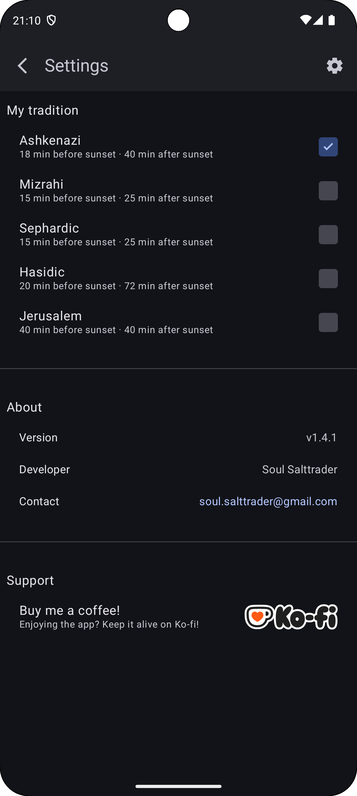
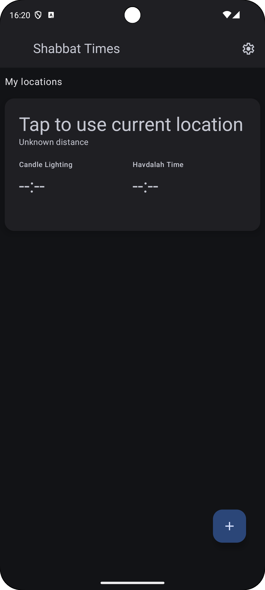
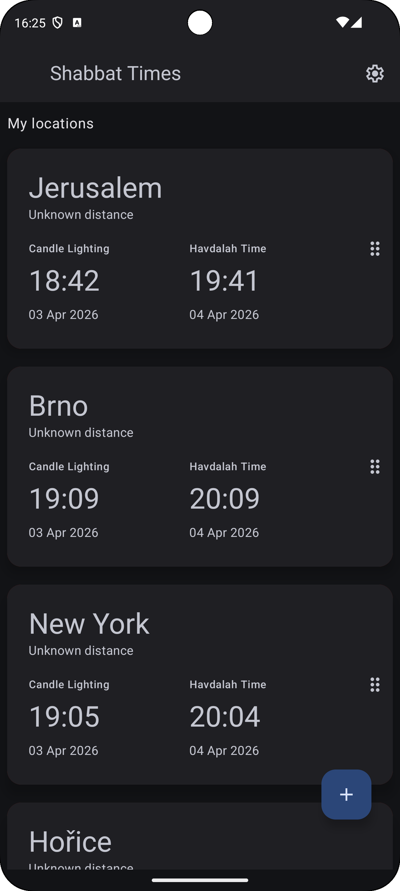

# 🕯 shabbat times app

### 📖 Overview

Shabbat Times is a calendar app that displays accurate candle lighting and Havdalah times for multiple 
locations worldwide.

The app fetches real-time sunset data and applies halachic offsets based on your community tradition — 
Ashkenazi, Sephardic, Mizrahi, Hasidic, or Jerusalem.

### 📸 Screenshots

- Screenshots reflect the current UI state at the time of capture.

<p align="start">
  
  
  
  
</p>

<p align="start">
  
  
  
  
</p>

---

## Table of Contents

1. [Current State of the App](#-current-state-of-the-app)
2. [Future Work](#-future-work)
3. [MVI Architecture Overview](#2--mvi-architecture-overview)
  1. [MVI Terminology Mapping](#mvi-terminology-mapping)
4. [Navigation](#3--navigation)
5. [Permissions Management](#4--permissions-management)
6. [Search Architecture](#5--search-architecture)
7. [Reorderable cards](#6--reorderable-cards)
8. [Current Location Feature](#7-current-location-feature)
9. [Persistence](#-8-persistence)

---

### 🏛️ Architecture

The app is built using modern Android architecture principles and libraries:

#### 🔵 1. UI — Jetpack Compose

- Example:

```kotlin
@Composable
fun ShabbatScreen() {
    val shabbatViewModel: ShabbatViewModel = hiltViewModel()
    val shabbatState by shabbatViewModel.state.collectAsStateWithLifecycle()

    val searchViewModel: SearchViewModel = hiltViewModel()
    val searchUiState by searchViewModel.state.collectAsStateWithLifecycle()

    val permissionViewModel: PermissionViewModel = hiltViewModel()
    val permissionUiState by permissionViewModel.state.collectAsStateWithLifecycle()

    LifecycleEventEffect(Lifecycle.Event.ON_RESUME) {
        if (permissionUiState.permission == PermissionState.DeniedPermanently) {
            permissionViewModel.dispatch(PermissionEvent.Request)
        }
    }

    HandlePermissions(
        permissions = listOf(
            Manifest.permission.ACCESS_FINE_LOCATION,
            Manifest.permission.ACCESS_COARSE_LOCATION,
        ),
        permissionState = permissionUiState,
        dispatch = permissionViewModel::dispatch,
    )

    PermissionDialogs(
        permissionState = permissionUiState,
        dispatch = permissionViewModel::dispatch,
    )

    val context = LocalContext.current

    val onCardClick = {
        when (permissionUiState.permission) {
            PermissionState.Granted           -> searchViewModel.dispatch(SearchEvent.GpsLocationRequested)
            PermissionState.Denied            -> permissionViewModel.dispatch(PermissionEvent.AcceptedRationale)
            PermissionState.DeniedPermanently -> permissionViewModel.dispatch(PermissionEvent.ShowDeniedPermanentlyDialog)
            else                              -> permissionViewModel.dispatch(PermissionEvent.ShowEducation)
        }
    }

    val searchConfig = SearchConfig(
        state = searchUiState.default(),
        action = searchViewModel.default(),
    )

    when (val entries = shabbatState.shabbat) {
        is ShabbatResultState.Idle    -> LoadingScreen()

        is ShabbatResultState.Loading -> LoadingScreen()

        is ShabbatResultState.Empty   -> {
            ShabbatContent(
                items = listOf(
                    ShabbatEntry(
                        location = SavedLocation.empty(),
                        times = null,
                        status = searchUiState.gpsResult.toLocationStatus(),
                    ),
                ).toImmutableList(),
                isDraggable = false,
                searchConfig = searchConfig,
                onClick = onCardClick,
            )
        }

        is ShabbatResultState.Ready   -> {
            ShabbatContent(
                items = entries.entries,
                swipeConfig = SwipeConfig(toLeft = SwipeState.Delete) { item ->
                    shabbatViewModel.dispatch(
                        ShabbatEvent.LocationDeleted(
                            savedLocation = item.location,
                            isCurrent = item.status == LocationStatus.Current,
                        )
                    )
                },
                searchConfig = searchConfig,
                onClick = onCardClick,
                onReorder = { from, to ->
                    shabbatViewModel.dispatch(
                        ShabbatEvent.ReorderLocations(from = from, to = to,)
                    )
                },
            )
        }

        is ShabbatResultState.Failure -> FailureScreen(
            message = entries.message,
            onRetry = { shabbatViewModel.dispatch(ShabbatEvent.RetryLoadShabbatEntry) },
        )
    }
    //..
}
```

#### 🔵 2. DI — Dagger Hilt

#### 🔵 3. ViewModel — MVI

- MVI

```kotlin
@HiltViewModel
class ShabbatViewModel @Inject constructor(
    @param:InMemory private val currentLocationRepository: CurrentLocationRepository,
    @param:Persisted private val savedLocationsRepository: SavedLocationsRepository,
    private val reorderLocationsUseCase: ReorderLocationsUseCase,
    private val getHalachicTimesUseCase: GetHalachicTimesUseCase,
    private val removeLocationUseCase: RemoveSavedLocationUseCase,
    userPreferencesRepository: UserPreferencesRepository,
    permissionRepository: PermissionRepository,
) : ViewModel() {
    private val _effects: MutableSharedFlow<AppEffect> = MutableSharedFlow(extraBufferCapacity = 20)
    val effects: SharedFlow<AppEffect> = _effects.asSharedFlow()

    @OptIn(ExperimentalCoroutinesApi::class)
    val halachicTimesFlow: StateFlow<List<HalachicTimes>> = combine(
        currentLocationRepository.location,
        savedLocationsRepository.locations,
        userPreferencesRepository.shabbatPreset,
    ) { gpsLocation, savedLocations, preset ->
        val locations = buildList {
            gpsLocation?.let { add(it) }
            addAll(savedLocations)
        }

        locations to preset
    }.flatMapLatest { (savedLocations, preset) ->
        flow {
            val results = getHalachicTimesUseCase(savedLocations, preset)
            val successes = results.filterIsInstance<NetworkResult.Success<HalachicTimes>>()
                .map { it.data }

            results.forEach { result ->
                when (result) {
                    is NetworkResult.Failure -> _effects.tryEmit(
                        AppEffect.ShowToast(result.cause.userMessage())
                    )
                    is NetworkResult.Success -> Unit
                }
            }

            emit(successes)
        }
    }
        .catch { cause ->
            dispatch(ShabbatEvent.ShabbatEntryLoadFailed(cause))
            _effects.tryEmit(AppEffect.ShowToast(cause.userMessage()))
            emit(emptyList())
        }
        .stateIn(
            scope = viewModelScope,
            started = SharingStarted.WhileSubscribed(5000),
            initialValue = emptyList(),
        )

    private val _state: MutableStateFlow<ShabbatUiState> = MutableStateFlow(value = ShabbatUiState())

    val state: StateFlow<ShabbatUiState> = combine(
        _state,
        halachicTimesFlow,
        currentLocationRepository.location,
        savedLocationsRepository.locations,
        permissionRepository.permissionState,
    ) { state, halachicTimes, currentLocation, savedLocations, permission ->
        ShabbatEvent.ShabbatEntryLoaded(savedLocations, currentLocation, halachicTimes, permission).reducer reduce state
    }.stateIn(
        scope = viewModelScope,
        started = SharingStarted.WhileSubscribed(5000),
        initialValue = ShabbatUiState(),
    )

    fun dispatch(event: AppEvent) {
        _state.updateAndGet { current ->
            when (event) {
                is ShabbatEvent -> event.reducer reduce current
                else            -> current
            }
        }

        when (event) {
            is ShabbatEvent.LocationDeleted  -> handleDeleteLocation(event)
            is ShabbatEvent.ReorderLocations -> handleReorderLocations(event)
            else                             -> Unit
        }
    }

    private fun handleReorderLocations(event: ShabbatEvent.ReorderLocations) {
        viewModelScope.launch {
            val entries = (state.value.shabbat as? ShabbatResultState.Ready)?.entries ?: return@launch
            reorderLocationsUseCase(entries, event.from, event.to)
        }
    }

    private fun handleDeleteLocation(event: ShabbatEvent.LocationDeleted) {
        viewModelScope.launch {
            removeLocationUseCase(event.savedLocation, event.isCurrent)
        }
    }
}
```

#### 🔵 4. Networking — OkHttp + Retrofit

- Example:
  ```kotlin
  @Provides
  @Singleton
  fun provideRetrofit(): Retrofit {
      val client = OkHttpClientFactory.create(Debug.enabled)
      val contentType = "application/json".toMediaType()

      return Retrofit.Builder()
          .baseUrl(BASE_SUNRISE_SUNSET)
          .client(client)
          .addConverterFactory(JsonConfig.json.asConverterFactory(contentType))
          .build()
  }
  ```

#### 🔵 5. Data Layer — Clean architecture with repository abstraction

| Repository | Responsibility |
|------------|----------------|
| `GpsLocationRepository` | Live device GPS, emits raw `Flow<Location?>` — never persisted |
| `CurrentLocationRepository` | Shared GPS-resolved location between ViewModels. `SearchViewModel` writes via `UpdateCurrentLocationUseCase`, `ShabbatViewModel` reads |
| `SavedLocationsRepository` | User-saved locations CRUD (in-memory, Room coming soon) |
| `GeocodingRepository` | Reverse geocode + autocomplete via Geoapify |
| `SolarTimesRepository` | Fetches solar times per `SolarTimesRequest` via HebCal API |

#### 🔵 6. KotlinX Serialization — For DTO parsing

#### 🔵 7. Domain Layer

| Model               | Description |
|---------------------|-------------|
| `SavedLocation`     | User-saved location with coordinates and timezone. Persisted (Room coming soon) |
| `ResolvedLocation`  | Geocoding API result. Never persisted — converted to `SavedLocation` on user save |
| `SolarTimesRequest` | Entry point for times domain. Contains coordinates, timezone and date only — no city concept |
| `HalachicTimes`     | Raw Shabbat times (LocalTime) — candle lighting and havdalah |
| `ShabbatEntry`      | UI model combining `SavedLocation` with `HalachicTimesDisplay` and `LocationStatus` |
| `Coordinates`       | Latitude/longitude pair, always normalized to 4 decimal places for reliable matching |

#### 🔵 8. Use Cases

| Use Case | Responsibility |
|----------|----------------|
| `GetHalachicTimesUseCase` | Computes candle lighting and havdalah times from solar times |
| `SaveLocationUseCase` | Converts `ResolvedLocation` → `SavedLocation` and persists |
| `RemoveLocationUseCase` | Removes saved location |
| `ResolveGpsLocationUseCase` | Combines GPS permission + location + reverse geocoding into single `Flow<ResolvedLocation?>` |
| `ObserveGpsLocationUseCase` | Observes GPS permission state, emits raw `Location?` when granted |
| `UpdateCurrentLocationUseCase` | Converts `ResolvedLocation?` → `SavedLocation?` and updates `CurrentLocationRepository` |

### 🌅 Solar Times API

The app uses the public API at https://sunrisesunset.io/ to fetch daily solar times (primarily
sunset).
The default location is currently Jerusalem, but dynamic user location is on the roadmap.

#### 🟢 1. Example API response (trimmed for relevance):

```kotlin
{
    "results": {
    "date": "2025-04-12",
    "sunset": "11:56:00 AM"
},
    "status": "OK"
}
```

#### 🟢 2. Retrofit endpoint definition:

```kotlin
interface SolarTimesApi {
    @GET("json")
    suspend fun getSolarTimes(
        @Query("lat") lat: Double = Coordinates.EMPTY.latitude,
        @Query("lng") lng: Double = Coordinates.EMPTY.longitude,
        @Query("timezone") timezone: String = ZoneId.systemDefault().id,
        @Query("time_format") timeFormat: Int = UserPreferences.DEFAULT_TIME_FORMAT,
        @Query("date") date: String? = null,
    ): SolarTimesResponseDto
}
```

```kotlin
@GET("autocomplete")
suspend fun autocomplete(
    @Query("text") queryText: String,
    @Query("filter") countryFilter: String? = null,
    @Query("type") resultType: String? = "city",

    @Query("limit") maxResults: Int = 5,
    @Query("lang") preferredLanguage: String = Locale.getDefault().language,
    @Query("format") format: String = "json",
    @Query("apiKey") apiKey: String = BuildConfig.GEOAPIFY_API_KEY,
): GeoapifyResponseDto
```

#### 🟢 3. DTO and domain mapping:

```kotlin
@Serializable
data class SolarTimesResponseDto(
    val results: SolarTimesResultDto = SolarTimesResultDto(),
    val status: String = "",
)

@Serializable
data class SolarTimesResultDto(
    val date: String = "",
    val sunset: String = "",
)

@Serializable
data class GeoapifyResponseDto(
    val results: List<GeoapifyResultDto>? = null,
    val status: String? = null,
    val query: GeoapifyQuery? = null
)

@Serializable
data class GeoapifyResultDto(
    @SerialName("lat") val latitude: Double? = null,
    @SerialName("lon") val longitude: Double? = null,
    val timezone: GeoapifyTimezone? = null,
// ...
)
```

#### 🟢 4. `GetHalachicTimesUseCase` fetches specific solar times for:

- upcoming Friday → used to compute candle lighting
- upcoming Saturday → used to compute Havdalah

Dates are provided by `ShabbatCalendar` — injected and testable:
```kotlin
interface ShabbatCalendar {
    fun upcomingCandleLightingDate(): LocalDate
    fun upcomingHavdalahDate(): LocalDate
}
```

`SolarTimesRepository` only fetches solar times for a given `SolarTimesRequest` — it has no knowledge of Shabbat, candle lighting, or havdalah concepts.

### 🕒 Halachic Times

Halachic times (zmanim) represent meaningful moments defined in Jewish law.

#### 🟡 1. Two key calculations are implemented:

Shabbat times are calculated based on your selected community tradition,
applied as offsets to the local sunset time:

| Community  | Candle Lighting | Havdalah  |
|------------|----------------|-----------|
| Sephardic  | 15 min before  | 25 min after |
| Mizrahi    | 15 min before  | 25 min after |
| Ashkenazi  | 18 min before  | 40 min after |
| Hasidic    | 20 min before  | 72 min after |
| Jerusalem  | 40 min before  | 40 min after |

The default tradition is Ashkenazi. Community preference is persisted
locally via DataStore and can be changed at any time in Settings.

#### 🟡 2. Domain model

```kotlin
data class HalachicTimes(
    val coordinates: Coordinates,
    val candleLightingTime: LocalTime,
    val candleLightingDate: LocalDate,
    val havdalahTime: LocalTime,
    val havdalahDate: LocalDate,
)
```

#### 🟡 3. Display model (used only by UI):

```kotlin
data class HalachicTimesDisplay(
    val coordinates: Coordinates,
    val candleLightingTime: String = EMPTY_TIME,
    val candleLightingDate: String = EMPTY_DATE,
    val havdalahTime: String = EMPTY_TIME,
    val havdalahDate: String = EMPTY_DATE,
) {
    companion object {
        const val EMPTY_TIME = "--:--"
        const val EMPTY_DATE = "dd/mm/yyyy"
    }
}
```

#### 🟡 4. Conversions are done via extensions:

```kotlin
fun HalachicTimes.toDisplay(): HalachicTimesDisplay
```

### 📅 Date & Time Handling

#### 🟣 1. To ensure accuracy and avoid parsing issues:

- All DTO fields (strings) are immediately converted into LocalDate and LocalTime domain objects.
- Calculations (± minutes) are performed only on strongly typed data.
- Formatting back to strings happens only at UI-binding time.

#### 🟣 2. Examples:

```kotlin
val API_DATE_PARSER = DateTimeFormatter.ISO_LOCAL_DATE
val API_TIME_PARSER_24 = DateTimeFormatter.ISO_LOCAL_TIME
val HEBREW_DATE_FORMATTER = DateTimeFormatter.ofPattern(HEBREW_DATE_PATTERN)
```

#### 🟣 3. Utility extensions include:

```kotlin
fun LocalDate.nextOrTodayDayOfWeek(target: DayOfWeek): LocalDate
fun upcomingFriday(): LocalDate
fun upcomingSaturday(): LocalDate
fun String.toLocalDate(): LocalDate
fun String.toLocalTime(): LocalTime
fun LocalDate.toDisplayString(): String
```

### 🏁 Current State of the App

#### 🟠 1. The app currently includes:

- Shabbat times screen with:
  - Candle lighting date & time
  - Havdalah date & time
  - Fully functional REST API integration
  - Domain-accurate halachic time calculations
  - Strong type-safety with Kotlin time models
  - Location autocomplete search
  - Dynamic GPS location with permission handling
  - User-saved locations with drag-to-reorder (order persisted via Room)
  - Dynamic location labels (current location, distance in km, locating, no permission)
  - Swipe-to-delete saved locations
  - Auto-refresh current location on app restart if permission granted
- Settings screen with:
  - Community tradition selector (Sephardic, Mizrahi, Ashkenazi, Hasidic, Jerusalem)
  - About section (version, contact, developer)
  - Ko-fi support link

### 🔜 Future Work

#### 🔴 1. Planned improvements:

- Add real Room migrations before removing `fallbackToDestructiveMigration`

#### 🔴 2. Recently resolved:

- ~~Permission state always Idle on restart~~ → synced on app start, GPS auto-refreshes if granted
- ~~Drag order lost on app restart~~ → persisted via Room with `sortOrder` column
- ~~Drag order lost during session~~ → preserved via `LaunchedEffect(items.size)` on recomposition
- ~~Hard-coded Jerusalem location~~ → dynamic GPS location + user-saved locations
- ~~Hard-coded 12/24h preference~~ → API always requests 24h format, display formatting in UI layer
- ~~City-coupled times domain~~ → times domain decoupled, uses `Coordinates` + `ZoneId` only
- ~~Adopt UiText for all hardcoded strings~~ → all user-facing strings use `UiText` / `strings.xml`
- ~~User-customizable candle lighting and havdalah offsets~~ → replaced with community tradition presets

---

## 🔄 MVI Architecture Overview

This project follows pure unidirectional MVI with a few naming choices that avoid Android-specific
confusion (e.g., "Event" instead of "Intent").

### Core MVI Concepts

- **AppState**  
  Single immutable source of truth. A data class that combines all feature-specific sub-states.

- **AppEvent**  
  Represents user intentions or external triggers. Implemented as a sealed hierarchy.  
  Each event is **self-reducing**: it carries its own pure reducer via the `Reducible<S>` interface.

    - **Reducer**  
      A pure function `(oldState: S) → newState: S` that computes the next sub-state.  
      Completely side-effect-free.

    - **Reducible&lt;S&gt;**  
      A marker interface that events implement to declare:  
      *"I know how to reduce a specific sub-state of type S."*  
      This enables the clean, boilerplate-free pattern where events reduce themselves.

- **AppEffect**  
  Represents imperative, one-shot side effects that cannot be expressed purely (e.g., starting
  background loops, network requests, showing toasts, navigation, logging).

## Data Flow

### Pure MVI Cycle (Concise)

```kotlin
savedLocationsRepository.locations + gpsLocationFlow
savedLocationsRepository.locations + currentLocationRepository.location
→ halachicTimesFlow fetches times per Coordinates (not per city)
→ combine merges savedLocations + currentLocation + halachicTimes + permissionState
→ reducer maps to ShabbatEvent.LocationWithTimesLoaded
→ computes LocationStatus per entry (Current/Nearby/Locating/NoPermission/Unknown)
→ produces ShabbatUiState with ImmutableList
→ UI observes StateFlow → renders automatically
```

```kotlin
savedLocationsRepository.locations (includes GPS entry with SavedLocation.GPS_ID)
currentLocationRepository.location (in-memory, resets on restart)
→ gpsLocationFlow in SearchViewModel resolves GPS via ResolveGpsLocationUseCase
→ updateCurrentLocationUseCase saves result to both currentLocationRepository and savedLocationsRepository
→ halachicTimesFlow fetches times per Coordinates (not per city)
→ combine merges savedLocations + currentLocation + halachicTimes + permissionState
→ reducer maps to ShabbatEvent.ShabbatEntryLoaded
→ computes LocationStatus per entry (Current/LastKnownLocation/Nearby/Locating/NoPermission/Unknown)
→ order determined by sortOrder from savedLocationsRepository (Room) or in-memory list
→ produces ShabbatUiState with ImmutableList
→ UI observes StateFlow → renders automatically
```

### Data sources in combine

| Flow | Source | Written by |
|------|--------|------------|
| `savedLocationsRepository.locations` | In-memory / Room | `SaveLocationUseCase`, `RemoveLocationUseCase` |
| `currentLocationRepository.location` | In-memory shared state | `UpdateCurrentLocationUseCase` via `SearchViewModel` |
| `halachicTimesFlow` | HebCal API | `GetHalachicTimesUseCase` |
| `permissionRepository.permissionState` | In-memory shared state | `PermissionViewModel` |

### Step-by-Step

1. **User Interaction**
  - UI calls `viewModel.dispatch(event)` (e.g. `GpsLocationRequested`, `LocationDeleted`)

2. **Pure State Reduction**
  - The event's reducer produces a new immutable `UiState`
  - No direct state mutation — reducers are pure functions

3. **Reactive Triggers**
  - `savedLocationsRepository.locations` — emits on every save/remove
  - `gpsLocationFlow` — emits when GPS resolves via `ResolveGpsLocationUseCase`
  - `permissionRepository.permissionState` — emits on permission changes
  - All combined via `combine` + `flatMapLatest`

4. **Asynchronous Work**
  - `halachicTimesFlow` observes all locations (saved + GPS)
  - For each new list, `GetHalachicTimesUseCase` fetches solar times per `Coordinates`
  - Times domain has zero knowledge of cities — only `Coordinates` + `ZoneId`
  - Partial failures show toast, full failures dispatch `ShabbatEntryLoadFailed`

5. **State Feedback**
  - Results transformed into Events (`ShabbatEntryLoaded`, `GpsPermissionChanged`)
  - Reducers compute `LocationStatus` (Current/Nearby/Unknown) dynamically
  - `ShabbatEntry` built by matching times to locations via normalized coordinates

6. **UI Update**
  - Compose observes `ShabbatUiState` — single source of truth
  - `ImmutableList` + `@Immutable` annotations ensure correct recomposition

  ```kotlin
  fun dispatch(event: AppEvent) {
      _state.updateAndGet { current ->
          when (event) {
              is ShabbatEvent -> event.reducer reduce current
              else            -> current
          }
      }

      when (event) {
          is ShabbatEvent.LocationDeleted  -> handleDeleteLocation(event)
          is ShabbatEvent.ReorderLocations -> handleReorderLocations(event)
          else                             -> Unit
      }
  }
  ```

### In Plain English

- The user does something → an Event is created and sent to the ViewModel (e.g. `GpsLocationRequested`, `LocationDeleted`, `SuggestionSelected`)
- The Event knows exactly how to calculate the new State (pure, no side effects).
- The ViewModel updates the State → the UI refreshes automatically.
- If something "real" needs to happen (fetch times, save location, show a toast), the ViewModel handles it reactively via Flows or sends an Effect.
- Flows (`halachicTimesFlow`, `currentLocationRepository.location`) observe data sources and feed into `combine` — state is always derived, never manually assembled.
- ViewModels communicate via shared repositories, not directly: `SearchViewModel` resolves GPS → writes to `CurrentLocationRepository` → `ShabbatViewModel` reads and reacts automatically.
- Same pattern for permissions: `PermissionViewModel` writes to `PermissionRepository` →`ShabbatViewModel` reads and computes `LocationStatus` per entry.
- Results flow back as new Events (`ShabbatEventLoaded`, `GpsPermissionChanged`), keeping everything in one direction.
- This unidirectional, pure MVI flow ensures predictability, testability,
  and easy reasoning about application behavior.

### MVI Terminology Mapping

| Project Term      | Common MVI Equivalent           | Notes                                                                                                                                                                                        |
|-------------------|---------------------------------|----------------------------------------------------------------------------------------------------------------------------------------------------------------------------------------------|
| Event             | Intent / Action                 | User intention or external trigger that drives state change                                                                                                                                  |
| State             | State / Model                   | Single immutable source of truth for the UI                                                                                                                                                  |
| Effect            | Effect / SideEffect / Command   | Imperative one-shot actions (network, start loop, toast)                                                                                                                                     |
| dispatch          | send / accept / dispatch        | Public entry point to send an Event into the ViewModel                                                                                                                                       |
| Reducer           | Reducer (central function)      | Pure function: (oldState, event) → newState (or sub-state)                                                                                                                                   |
| Reducible         | no direct equivalent            | Marker interface saying "this Event carries its own reducer". Also known as self-reducing events, reducer-carrying actions, or fat actions. Avoids central when switch — clean and scalable. |
| Event + Reducible | Central when (event) in reducer | preferred variant for readability and no boilerplate                                                                                                                                         |

### Why separate Events from Effects?

- `Events` are declarative: "I want to load Shabbat times", "Start breathing".
    - They only describe intent and how the state should change.
- `Effects` are reactive:
    - Async work (network, disk, permissions) is triggered by observing state or repository flows
    - This work lives in Flows (flatMapLatest, combine, etc.), not inside reducers

### Benefits

- Unidirectional data flow ensures predictability and traceability
- Pure reducers → easy unit testing (event → state)
- Side effects are driven by state, not by imperative commands
- Async work is lifecycle-aware and cancelable by default
- No hidden behavior: everything reacts to explicit state changes
- Scales naturally as new Flows are added (data, permissions, location, analytics)

### Example: Shabbat times loading

1. `ShabbatViewModel` observes four data sources via `combine`:
  - `savedLocationsRepository.locations` — user-saved locations
  - `currentLocationRepository.location` — GPS-resolved location (written by `SearchViewModel`)
  - `halachicTimesFlow` — fetched times per `Coordinates`
  - `permissionRepository.permissionState` — for `LocationStatus` computation

2. `halachicTimesFlow` reacts to any change in locations (saved or GPS):
  - Combines saved locations + current GPS location into one list
  - Calls `GetHalachicTimesUseCase(allLocations)` — fetches solar times per `Coordinates`
  - Partial failures show a toast, full failure dispatches `ShabbatEntryLoadFailed`
  - Emits `List<HalachicTimes>` with raw `LocalTime` values

3. `ShabbatEntryLoaded` reducer:
  - Matches times to locations via normalized `Coordinates`
  - Computes `LocationStatus` per entry from permission + GPS distance:
    - `NoPermission` — permission denied
    - `Locating` — permission requesting
    - `Current` — distance < 0.1km
    - `Nearby(distanceKm)` — distance ≥ 0.1km
    - `Unknown` — no GPS available
  - Builds `ImmutableList<ShabbatEntry>` for UI

4. `ShabbatResultState` transitions:
  - `Empty` — no saved locations and no GPS location
  - `Loading` — locations exist but times not yet fetched (per-card spinner)
  - `Ready(entries)` — locations and times both present
  - `Failure` — unrecoverable error

5. Empty card (no locations yet) — `LocationStatus` derived from `SearchResultState.gpsResult`:
  - `Idle/Empty` → `Unknown` → "Unknown distance"
  - `Loading` → `Locating` → "Getting your location..."
  - `GpsResolved` → `Current` → "Your current location"

6. UI observes single `ShabbatUiState` — cards render immediately with spinner,
   times fill in per-card when fetched

---

## 🧭 Navigation

A **type-safe, scalable, testable, and production-proven** navigation system built for modern
Android apps using Jetpack
Compose + Navigation + Hilt + Kotlin Serialization.

### 🏛️ Core Principles

| Principle                      | Implementation & Benefit                                                                            |
|--------------------------------|-----------------------------------------------------------------------------------------------------|
| **Reusable UI**                | No `NavController` in UI → UI components stay dumb and reusable                                     |
| **Type-safe**                  | Sealed interfaces + `@Serializable` + `hasRoute<T>()` → no strings, no crashes                      |
| **flows through `NavManager`** | All navigation goes through `NavManager` No other class talks to `NavController` or reads backstack |
| **Modular & scalable**         | Separate graph functions per feature → easy to maintain, test, and extend                           |
| **Deep link safe**             | Full support out of the box — no extra code needed                                                  |
| **Testable**                   | `NavManager` is Hilt-injectable singleton → easy to mock in unit & UI tests                         |

### 🏛️ Core Components

| Component          | Responsibility                                                                             |
|--------------------|--------------------------------------------------------------------------------------------|
| 1. `NavTarget`     | Sealed hierarchy of **all app destinations** — the heart of type-safe navigation           |
| 2. `NavItem`       | Visual + behavioral representation of a navigation item (icon, title, badge, role)         |
| 3. `NavRole`       | Defines where the item appears: bottom tab, top navigation, action button, etc.            |
| 4. `NavAction`     | Sealed class representing navigation commands (`To`, `Up`, `ResetTo`, etc.)                |
| 5. `NavManager`    | Singleton brain: emits commands, exposes current destination, fully injectable             |
| 6. `*.NavGraph.kt` | Feature-isolated graph builders (`authNavGraph`, `bottomNavGraph`, `alertsNavGraph`, etc.) |
| 7. `NavApp`        | Root composable — the **only** place that talks to `NavController`                         |
| 8. UI Components   | `NavBarBottom`, `NavBarTop`, `NavBarIcon`, ... — pure UI, zero navigation logic            |

### 🔵 1. NavTarget — Type-Safe Destinations

- The **foundation** of the entire system.
- No string routes. No `::class.qualifiedName`. No reflection.
- Uses Jetpack Navigation’s `hasRoute<T>()` → **100% compile-safe and R8-safe**.

```kotlin
@Serializable
sealed interface NavTarget {
    companion object {
        fun NavBackStackEntry?.fromBackStackEntry(): NavTarget? {
            return when {
                this?.destination?.hasRoute<NavTargetTop.Settings>() == true   -> NavTargetTop.Settings
                this?.destination?.hasRoute<NavTargetTop.Previous>() == true   -> NavTargetTop.Previous

                this?.destination?.hasRoute<NavTargetBottom.Shabbat>() == true -> NavTargetBottom.Shabbat
                else                                                           -> null
            }
        }
    }
}

@Serializable
sealed interface NavTargetTop : NavTarget {
    @Serializable object Previous : NavTargetTop
    @Serializable object Settings : NavTargetBottom
}
```

### 🔵 2. NavItem - Navigation UI Metadata

- Encapsulates everything needed to render a navigation item in bottom bar, or top bar.

```kotlin
data class NavItem(
    val target: NavTarget,
    val title: String?,
    val selectedIcon: UiIcon,
    val unselectedIcon: UiIcon,
    val role: NavRole,
)

object NavItems {

    val Settings = NavItem(
        target = NavTargetTop.Settings,
        title = UiText.Resource(R.string.nav_settings),
        selectedIcon = UiIcon.Resource(R.drawable.settings_filled_24),
        unselectedIcon = UiIcon.Resource(R.drawable.settings_outlined_24),
        role = NavRole.TOP_ACTION,
    )
    // ...
}
```

### 🔵 3. NavRole - Placement & Behavior

- Defines where and how a NavItem should be displayed.

```kotlin
enum class NavRole {
    BOTTOM_TAB,
    TOP_NAVIGATION,
    TOP_ACTION,
    // ...
}
```

### 🔵 4. NavAction - Navigation Commands

- Sealed hierarchy of all possible navigation actions.
- Emitted by NavManager, consumed only by NavApp.
- navOptions: NavOptionsBuilder.() -> Unit enabling customization of navigation behavior.
- Applied sensible defaults.

```kotlin
sealed interface NavAction {

    data class To(
        val target: NavTarget,
        val navOptions: NavOptionsBuilder.() -> Unit = {
            launchSingleTop = true
            restoreState = true
        }
    ) : NavAction

    data class ResetTo(
        val target: NavTarget,
        val navOptions: NavOptionsBuilder.() -> Unit = {
            popUpTo(0) { inclusive = true }
            launchSingleTop = true
        }
    ) : NavAction

    data class PopTo(
        val target: NavTarget,
        val navOptions: NavOptionsBuilder.() -> Unit = { }
    ) : NavAction

    data object Up : NavAction
    data object PopToRoot : NavAction
}
```

### 🔵 5. NavManager - The Brain

- Singleton injected via Hilt.
- Only source of navigation commands and current destination.
    - Only NavApp calls updateCurrentTarget() → one-way data flow
    - All UI and ViewModels use navigateTo(), resetRoot(), etc.

```kotlin
@Singleton
class NavManager @Inject constructor() {
    private val _commands = MutableSharedFlow<NavAction>(extraBufferCapacity = 1)
    val commands = _commands.asSharedFlow()

    private val _currentTarget = MutableStateFlow<NavTarget?>(value = null)
    val currentTarget = _currentTarget.asStateFlow()

    internal fun updateCurrentTarget(target: NavTarget?) {
        _currentTarget.value = target
    }

    fun navigateTo(target: NavTarget) = _commands.tryEmit(NavAction.To(target))
    fun navigateUp() = _commands.tryEmit(NavAction.Up)
    fun resetRoot(target: NavTarget) = _commands.tryEmit(NavAction.ResetTo(target))
    fun popTo(target: NavTarget) = _commands.tryEmit(NavAction.PopTo(target))
    fun popToRoot() = _commands.tryEmit(NavAction.PopToRoot)
}
```

### 🔵 6. NavGraph — Modular & Clean

- Navigation graphs are pure functions — no @Composable, no navController passed around.

```kotlin
fun NavGraphBuilder.mainNavGraph(snackbarHostState: SnackbarHostState) {
    composable<NavTargetBottom.Shabbat> { ShabbatScreen(snackbarHostState) }
    composable<NavTargetTop.Settings> { SettingsScreen() }
}
```

### 🔵 7. NavApp — The Bridge

- The only place that touches NavController.
- Syncs real navigation state → NavManager.

```kotlin
@Composable
fun NavApp(
    modifier: Modifier,
    navigator: Navigator,
    snackbarHostState: SnackbarHostState,
) {
    val navController = rememberNavController()
    val currentBackStackEntry by navController.currentBackStackEntryAsState()

    LaunchedEffect(currentBackStackEntry) {
        navigator.syncBackStackWithNavigator(currentBackStackEntry)
    }

    LaunchedEffect(Unit) {
        navigator.collectNavigationCommands(navController)
    }

    val startDestination = NavTargetBottom.Shabbat

    NavHost(
        modifier = modifier,
        navController = navController,
        startDestination = startDestination,
    ) {
        mainNavGraph(snackbarHostState)
    }
    //...
}
```

### 🔵 8. UI Components Pure & Reusable

- Zero knowledge of NavController. Zero strings.

```kotlin
@Composable
fun NavBarIcon(
    isSelected: Boolean,
    item: NavItem,
    badgeCount: Int? = null,
) {
    BadgedBox(badge = { NavBarBadge(badgeCount) }) {
        UiIconImage(
            icon = if (isSelected) item.selectedIcon else item.unselectedIcon,
            contentDescription = item.title,
        )
    }
}
```

```kotlin
@Composable
fun NavBarBadge(count: Int? = null) {
    val displayCount = count?.takeIf { it > 0 } ?: return

    Badge(
        containerColor = MaterialTheme.colorScheme.tertiary,
        contentColor = MaterialTheme.colorScheme.onTertiary,
    ) {
        Text(text = if (displayCount > 99) stringResource(R.string.display_count_max) else displayCount.toString())
    }
}
```

```kotlin
@Composable
fun NavBarTop(
    navItems: List<NavItem>,
    navigator: Navigator,
    scrollBehavior: TopAppBarScrollBehavior,
    currentNavTarget: NavTarget? = null,
    isNavIconVisible: Boolean = currentNavTarget != NavTargetBottom.Shabbat,
) {
    val (topNavigationItem, topActionItems) = navItems.extractTopBarItems()

    TopAppBar(
        colors = TopAppBarColors(
            containerColor = MaterialTheme.colorScheme.surfaceContainer,
            scrolledContainerColor = MaterialTheme.colorScheme.surfaceContainer,
            navigationIconContentColor = MaterialTheme.colorScheme.onSurfaceVariant,
            titleContentColor = MaterialTheme.colorScheme.onSurfaceVariant,
            actionIconContentColor = MaterialTheme.colorScheme.onSurfaceVariant,
            subtitleContentColor = MaterialTheme.colorScheme.onSurfaceVariant,
        ),
        title = { currentNavTarget?.titleOr()?.let { Text(text = it.asString()) } },
        navigationIcon = {
            topNavigationItem?.let {
                IconButton(
                    onClick = { navigator.navigateUp() },
                    enabled = isNavIconVisible,
                    modifier = Modifier.alpha(if (isNavIconVisible) 1f else 0f)
                ) {
                    NavBarIcon(
                        isSelected = false,
                        badgeCount = null,
                        item = it,
                    )
                }
            }
        },
        actions = {
            topActionItems.forEach { item ->
                val onItemClick = { navigator.navigateTo(item.target) }

                IconButton(onClick = { onItemClick() }) {
                    NavBarIcon(
                        isSelected = currentNavTarget == item.target,
                        badgeCount = null,
                        item = item,
                    )
                }
            }
        },
        scrollBehavior = scrollBehavior
    )
}
```

---

## 🚦 Permissions Management

- Implements a robust permission system for requesting and managing Android location permissions.
- Crucial for fetching the user's location and calculating accurate Shabbat times.
- Permission state is synced with real device state on app start — correctly restores `Granted`, `Denied`, or `DeniedPermanently` after restart.

### Key Features

- Syncs real device permission state on app start — no stale `Idle` state after restart
- Checks whether required permissions are already granted — avoids unnecessary requests
- Launches the native Android permission dialog only when needed
- Correctly distinguishes between:
  - temporary denials — shows rationale dialog
  - permanent denials — guides to app settings
- Separates dialog visibility (`isDialogVisible`) from permission state — dismissing a dialog never resets underlying permission
- Re-checks permission when user returns from system settings (`ReturnedFromAppSettings`)
- Fully asynchronous using Kotlin coroutines — no UI blocking
- Clean state management with sealed interfaces + reducers
- User-friendly in-app explanations and retry/settings navigation flows
- Reusable abstraction (`PermissionHandler` interface) — easy to adapt for camera, storage, notifications

### Core Components

| Component | Role | Type |
|---|---|---|
| `PermissionHandler` | Suspendable API to request, check, and handle permission results | Interface + Impl |
| `PermissionResult` | Domain-level outcome of a permission request | Sealed interface |
| `PermissionState` | Underlying permission state (Granted, Denied, DeniedPermanently...) | Sealed interface |
| `PermissionUiState` | UI state — combines `PermissionState` + `isDialogVisible` | Data class |
| `PermissionEvent` | User/system intents that drive state transitions, each with a reducer | Sealed interface |
| `HandlePermissions` | Orchestrator — syncs state on start, reacts to lifecycle, triggers requests | Composable |
| `PermissionDialogs` | Renders appropriate dialog based on `PermissionUiState` | Composable |
| `rememberPermissionHandler` | Creates and remembers handler + `ActivityResultLauncher` | Composable factory |

### High-Level Flow

1. App starts → `HandlePermissions` syncs real device permission via `resolvePermissionEvent()`
2. If already granted → GPS starts automatically
3. If not granted → user taps GPS card → appropriate dialog shown based on permission state
4. User responds → event dispatched → state updated via reducer
5. System permission dialog shown if needed (`Requesting` state)
6. Based on result → `Granted`, `DeniedWithRationale`, or `DeniedPermanently`
7. `DeniedPermanently` → settings dialog → user opens settings → `ReturnedFromAppSettings` re-checks on resume

### Visualized Flow

```markdown
Start
│
└─ 👤 Requests (ShabbatViewModel.dispatcher)
   │
   ├─ event Request ─ state Requesting
   │
   └─ 🤖 The `HandlePermissions` composable uses `rememberPermissionHandler` to check whether the permissions are already granted.
      │
      ├─ Yes
      │  └── result Granted ─ event AllGranted ─ state Granted ✅
      │
      └─ No (Launch system dialog 💬)
         │
         ├─ 👤 Allows all 
         │  └── result Granted ─ event AllGranted ─ state Granted ✅
         │
         └─ 👤 Denies (Show rationale dialog 💬)
            │
            └── result Explain ─ event DeniedWithRationale ─ state Denied ❗
                       │
                       ├─ 👤 Allows  
                       │  └── event AcceptedRationale ─ state Requesting
                       │
                       ├─ 👤 Cancels
                       │  └── event DismissedRationale ─ state Idle ❌❗
                       │
                       └─ 👤 Denies 💬 (Show "go to settings" dialog)
                          │
                          └── result Blocked ─ event DeniedPermanently ─ state DeniedPermanently 🚫
                                     │
                                     ├─ 👤 Opens settings
                                     │  └── event RequestedAppSettings ─ state Idle ─ effect OpenAppSettings ✨
                                     │
                                     └─ 👤 Cancels
                                        └── event DismissedRationale ─ state Idle ❌🚫
```

### Structured Components

- The code is modular, divided into interfaces, classes, composables, and sealed hierarchies. Below is a breakdown by component.

#### 🟢 1. PermissionHandler Interface

- Definition: Interface for requesting and checking permissions asynchronously.
- Methods:
  - `suspend fun request(permissions: List<String>): PermissionResult`
  - `fun isGranted(permission: String): Boolean`
  - `fun shouldShowRationale(permission: String): Boolean`
- `request()` takes a list of permission strings and returns a `PermissionResult` (sealed interface: `Granted`, `Explain`, or `Blocked`).
- `isGranted()` and `shouldShowRationale()` allow checking permission state without triggering a request — used for syncing state on app start.

#### 🟢 2. PermissionHandlerImpl Class

- Dependencies:
  - `checkPermission`: Lambda to check if a permission is already granted (`ContextCompat.checkSelfPermission`).
  - `checkShouldShowRationale`: Lambda to check if rationale should be shown (`ActivityCompat.shouldShowRequestPermissionRationale`).
  - `launch`: Lambda to start the permission request dialog (via `ActivityResultLauncher`).

- Internal State: A `CancellableContinuation` to handle coroutine suspension and resumption.

- `request()` Function:
  - Uses `suspendCancellableCoroutine` to pause until the result is available.
  - Filters out already granted permissions.
  - If all are granted, resumes immediately with `Granted`.
  - Otherwise, launches the request and waits.

- `onResult()` Function:
  - Called when the system returns permission results (map of permission to boolean).
  - Categorizes results: granted, denied, permanently denied.
  - Resumes the coroutine with the appropriate `PermissionResult`.
  - Clears the continuation to allow future requests.

- `isGranted()` / `shouldShowRationale()` delegate to constructor lambdas.

- This class bridges the Android permission API with coroutines.

#### 🟢 3. Permission State Management

- `PermissionUiState` contains both `permission: PermissionState` and `isDialogVisible: Boolean` — separating dialog visibility from underlying permission state.
- Dismissing a dialog sets `isDialogVisible = false` without resetting `permission` — prevents state loss on dismiss.
- `PermissionState.Idle` — never asked. `PermissionState.Hidden` removed in favor of `isDialogVisible`.
- On app start, `resolvePermissionEvent()` extension on `PermissionHandler` checks real device permission and syncs repository state — ensures `Granted`/`Denied`/`DeniedPermanently` are correctly restored after restart.
- `ReturnedFromAppSettings` event re-triggers permission request when user returns from system settings.

```kotlin
class PermissionHandlerImpl(
    private val checkPermission: (String) -> Boolean,
    private val checkShouldShowRationale: (String) -> Boolean,
    private val launch: (Array<String>) -> Unit,
) : PermissionHandler {
    override fun isGranted(permission: String): Boolean = checkPermission(permission)
    override fun shouldShowRationale(permission: String): Boolean = checkShouldShowRationale(permission)

    private var continuation: CancellableContinuation<PermissionResult>? = null

    override suspend fun request(permissions: List<String>): PermissionResult =
        suspendCancellableCoroutine { cont ->
            check(continuation == null) { "Permission request already in progress" }

            val missing = permissions.filterNot { isGranted(it) }

            if (missing.isEmpty()) {
                cont.resume(PermissionResult.Granted)
                return@suspendCancellableCoroutine
            }

            continuation = cont
            launch(missing.toTypedArray())

            cont.invokeOnCancellation {
                continuation = null
            }
        }

    fun onResult(result: Map<String, Boolean>) {
        val cont = continuation ?: return
        try {
            val denied = result.filterValues { !it }.keys.toList()
            val permanentlyDenied = denied.filterNot(checkShouldShowRationale)

            when {
                denied.isEmpty() -> {
                    cont.resume(PermissionResult.Granted)
                }

                permanentlyDenied.isNotEmpty() -> {
                    cont.resume(PermissionResult.Blocked(permissions = permanentlyDenied))
                }

                else -> {
                    cont.resume(PermissionResult.Explain(permissions = denied))
                }
            }
        } finally {
            continuation = null
        }
    }
}
```

#### 🟢 4. HandlePermissions Composable

- Parameters:
  - `permissions`: List of permissions to request.
  - `permissionState: PermissionUiState` — full UI state including `isDialogVisible`.
  - `dispatch`: Function to send `PermissionEvent`s to the ViewModel.

- Behavior:
  - `LaunchedEffect(Unit)` — syncs real device permission on first composition via `resolvePermissionEvent()`:
    - Restores `Granted`, `Denied`, or `DeniedPermanently` correctly on app restart.
  - `LaunchedEffect(permissionState.permission)` — triggers system permission dialog when state is `Requesting`.
  - `LifecycleEventEffect(ON_RESUME)` — re-checks permission when user returns from app settings.
  - Uses `rememberUpdatedState` to avoid stale state in lifecycle callbacks.

- Dialog rendering extracted to `PermissionDialogs` composable:
  - Only shown when `isDialogVisible = true`.
  - `Education` — explains location need, offers "Continue" or "Add manually".
  - `Denied` — offers "Allow" (re-request) or dismiss.
  - `DeniedPermanently` — prompts to open system settings.
  - Dismissing any dialog sets `isDialogVisible = false` without resetting permission state.

```kotlin
@Composable
fun HandlePermissions(
    permissions: List<String>,
    permissionState: PermissionState,
    dispatch: (PermissionEvent) -> Unit,
) {
    val permissionHandler = rememberPermissionHandler()
    val context = LocalContext.current

  LaunchedEffect(Unit) {
    permissionHandler.resolvePermissionEvent(permissions)?.let(dispatch)
  }

    LaunchedEffect(permissionState) {
        if (permissionState == PermissionState.Requesting) {
            val result = permissionHandler.request(permissions)

            when (result) {
                is PermissionResult.Granted -> dispatch(PermissionEvent.AllGranted)
                is PermissionResult.Explain -> dispatch(PermissionEvent.DeniedWithRationale)
                is PermissionResult.Blocked -> dispatch(PermissionEvent.DeniedPermanently)
            }
        }
    }
// ...
}
```

#### 🟢 5. Sealed Interfaces

- `PermissionState`:
  - `Idle` — never asked.
  - `Education` — showing initial explanation dialog.
  - `Requesting` — system permission dialog in progress.
  - `Granted` — all permissions approved.
  - `Denied` — denied once, rationale can be shown.
  - `DeniedPermanently` — denied permanently, requires settings.

- `PermissionResult`:
  - `Granted` — success.
  - `Explain(permissions)` — denied, show rationale.
  - `Blocked(permissions)` — permanently denied.

- `PermissionEvent`:
  - `ShowEducation` — show initial education dialog.
  - `Request` — start system permission request.
  - `AllGranted` / `DeniedWithRationale` / `DeniedPermanently` — update state based on result.
  - `AcceptedRationale` — user agrees after explanation, re-request.
  - `DismissedRationale` — hides dialog, preserves underlying permission state.
  - `RequestedAppSettings` — open system app settings.
  - `ReturnedFromAppSettings` — re-triggers permission request on return from settings.
  - `ShowDeniedPermanentlyDialog` — shows settings dialog when tapping GPS card while permanently denied.
  - Each event carries a reducer lambda to update `PermissionUiState` immutably.

- `PermissionUiState`:
  - `permission: PermissionState` — underlying permission state.
  - `isDialogVisible: Boolean` — controls dialog visibility independently of permission state.

#### 🟢 6. Usage in ShabbatScreen Composable

- Injects `PermissionViewModel` and `ShabbatViewModel` via Hilt.
- Collects state with `collectAsStateWithLifecycle`.
- Calls `HandlePermissions` with location permissions, current `PermissionUiState`, and dispatch.
- Calls `PermissionDialogs` separately — clean separation of system handling and UI.
- `onCardClick` handles all permission states:
  - `Granted` → trigger GPS search
  - `Denied` → show rationale dialog
  - `DeniedPermanently` → show settings dialog
  - `Idle/Education` → show education dialog

- See: [1. UI — Jetpack Compose](#-1-ui--jetpack-compose)

#### 🟢 7. ViewModel

- dispatch(event):
    - Updates _state using the event's reducer (for data, permission, or location events).
    - Emits effects for side actions (e.g., open settings).

- This centralizes state updates and effects.
- See: [3. ViewModel — MVI (and experimental MVVM)](#-3-viewmodel--mvi-and-experimental-mvvm)

---

## 🔍︎ Search Architecture

The search functionality is designed as a reactive, modular system that bridges user input with the core calculation engine. It demonstrates a clean separation between generic UI components, domain-specific state wrappers, and optimized data fetching.

### Key Features

- **Atomic UI Design**: A three-tier hierarchy (Generic `SearchBarInputField` → Domain-Specific `CitySearchBarInputField` → `CitySearchScreen`) that ensures UI components remain stateless, reusable, and easy to test.
- **Self-Reducing MVI**: Search events implement `Reducible<SearchUiState>`, moving business logic into discrete, testable units (`SearchReducer`) and keeping the ViewModel as a clean orchestrator.
- **Robust State Wrappers**: Replaces primitive strings with `Input<T>` and `Selection<T>` types to explicitly model field states (Idle, Value, Loading, Empty), eliminating "null-checking hell" in the UI.
- **Reactive Data Pipeline**: Utilizes a reactive bridge where a city selection in the search module automatically triggers a data re-fetch in the halachic module via `flatMapLatest`.
- **Performance Optimized**: Features built-in 300ms debouncing, minimum query thresholds (2+ chars), and automatic geo-localization based on the user's system locale.
- **Smart UX Logic**: Encapsulates complex interactions, such as the dual-purpose trailing icon (Clear vs. Collapse), into isolated helper functions to maintain UI readability.

### Core Components

| Component                  | Role                                                                                                                                                            | Type       |
|----------------------------|-----------------------------------------------------------------------------------------------------------------------------------------------------------------|------------|
| SearchBarInputField        | A generic, private composable that wraps SearchBarDefaults.InputField and provides a standard setup for text state, expansion, and search actions.              | Composable | 
| LocationSearchBarInputField | A specialized, public composable that configures SearchBarInputField with specific defaults for city searching (placeholder text, icons, etc.).                 | Composable | 
| LocationSearchScreen        | The main screen composable that orchestrates the search UI, manages state, and handles user events.                                                             | Composable |
| onTrailingIconClick        | A private helper function that determines the action for the trailing icon: clear the query if it exists, or toggle the search bar's expansion state otherwise. | Function   |

### High-Level Flow

See [5.1 Search State Management](#51--search-state-management-searchviewmodel) for detailed autocomplete and GPS resolution flows.

In brief:
- User types → debounced query → `GeocodingRepository.autocomplete()` → suggestions
- User taps card → GPS resolves → `CurrentLocationRepository` + `SavedLocationsRepository` updated
- `ShabbatViewModel` reacts to repository changes automatically

### Structured Components

#### 🔵 1. SearchBarInputField

A foundational, private composable that abstracts Material 3's SearchBarDefaults.InputField into a standardized, reusable component.
- Purpose: Encapsulates boilerplate configurations (shape, padding, text-field state logic) to ensure UI consistency across different search contexts while hiding implementation details.
- Contract: Exposes a clean API for state management and functional callbacks (onSearch, onExpandedChange).

```kotlin
@Composable
@OptIn(ExperimentalMaterial3Api::class, FlowPreview::class)
private fun SearchBarInputField(
    state: TextFieldState,
    expanded: Boolean,
    onSearch: (String) -> Unit,
    onExpandedChange: (Boolean) -> Unit,

    modifier: Modifier = Modifier,
    placeholder: @Composable (() -> Unit)?,
    leadingIcon: @Composable (() -> Unit)?,
    trailingIcon: @Composable (() -> Unit)?,
    shape: Shape = RoundedCornerShape(16.dp),
) {
    SearchBarDefaults.InputField(
        state = state,
        expanded = expanded,
        onSearch = { onSearch(state.text.toString()) },
        onExpandedChange = { onExpandedChange(!expanded) },
        modifier = modifier.fillMaxWidth(),
        placeholder = placeholder,
        leadingIcon = leadingIcon,
        trailingIcon = trailingIcon,
        shape = shape,
    )
}
```

#### 🔵 2. LocationSearchBarInputField

A domain-specific specialization of SearchBarInputField pre-configured for geographic lookups.
- Purpose: Provides a specialized search entry point with pre-defined city-related icons and localized strings.
- Smart Logic: Integrates the onTrailingIconClick helper to handle the contextual transition between "clearing text" and "collapsing the UI."

```kotlin
@Composable
fun LocationSearchBarInputField(
    state: TextFieldState,
    hasQuery: Boolean,
    onExpandedChange: (Boolean) -> Unit,
    expanded: Boolean,
    onSearch: (String) -> Unit,
    onClear: () -> Unit,
    // ...
    trailingIcon: @Composable (() -> Unit)? = {
        TrailingSearchIconButton(
            onClick = onTrailingIconClick(hasQuery, onClear, onExpandedChange, expanded)
        )
    },
) {
    SearchBarInputField(
        state = state,
        expanded = expanded,
        onSearch = onSearch,
        onExpandedChange = onExpandedChange,
        placeholder = placeholder,
        leadingIcon = leadingIcon,
        trailingIcon = trailingIcon,
    )
}
```

#### 🔵 3. LocationSearchScreen (The Orchestrator)

The top-level screen container that bridges the MVI state with the UI components.
- Role: A stateless orchestrator that observes the SearchUiState and maps UI callbacks to the dispatch function.
- Composition: Manages the vertical layout between the input field and the CitySearchSuggestionPanel, ensuring smooth transitions between expanded and collapsed states.

```kotlin
@Composable
fun LocationSearchScreen(
    searchConfig: SearchConfig,
    modifier: Modifier = Modifier,
) {
    //...

    Surface(
        modifier = modifier
            .fillMaxWidth()
            .padding(horizontal = 32.dp),
        shape = RoundedCornerShape(20.dp),
        tonalElevation = 6.dp
    ) {
        Column(
            modifier = Modifier.fillMaxWidth()
        ) {
            LocationSearchBarInputField(
                state = state,
                hasQuery = searchConfig.state.hasQuery,
                expanded = searchConfig.state.searchActive,
                onExpandedChange = { expanded -> searchConfig.action.onChangeVisibility(!expanded) },
                onSearch = { query ->
                    searchConfig.action.onQueryChanged(query)
                    searchConfig.action.onSearchCommitted()
                },
                onClear = {
                    searchConfig.action.onQueryCleared()
                    state.clearText()
                },
            )

            LocationSearchSuggestionPanel(
                query = state.text.toString(),
                expanded = searchConfig.state.searchActive,
                suggestions = searchConfig.state.suggestions,
                onSuggestionSelected = { suggestion ->
                    searchConfig.action.onSuggestionSelected(suggestion)
                    state.setTextAndPlaceCursorAtEnd(suggestion.name)
                },
            )
        }
    }
}
```

## 🧠 Search State Management (SearchViewModel)

### The SearchViewModel

The `SearchViewModel` manages two distinct search modes — text-based autocomplete and GPS reverse geocoding — while acting as the writer of `CurrentLocationRepository` for cross-ViewModel GPS state sharing.

### Key Responsibilities

- **Autocomplete Search:** Reactive pipeline (`queryFlow` → debounce 300ms → `flatMapLatest`) transforms user input into `List<ResolvedLocation>` suggestions via `GeocodingRepository.autocomplete()`
- **GPS Resolution:** Observes `ResolveGpsLocationUseCase` flow — when GPS resolves, writes `SavedLocation` to `CurrentLocationRepository` via `UpdateCurrentLocationUseCase`
- **Reactive State Exposure:** Exposes `SearchUiState` via `StateFlow` — combines base state + `suggestionResults` + `gpsResult`
- **Unidirectional Event Dispatch:** Single `dispatch(AppEvent)` entry point with  self-reducing events — each `SearchEvent` contains its own reducer
- **Cross-ViewModel Communication:** Writes GPS-resolved location to `CurrentLocationRepository` — `ShabbatViewModel` observes without knowing about `SearchViewModel`
- **Lifecycle-Aware Streaming:** `stateIn(viewModelScope, WhileSubscribed(5000))` — flows only active while UI is subscribed
- **Side-Effect Management:** One-shot actions (toasts, navigation) via `SharedFlow<AppEffect>`, separate from state updates

| Component      | Role                                                                                                                                                             | Type             |
|----------------|------------------------------------------------------------------------------------------------------------------------------------------------------------------|------------------|
| SearchUiState  | A data class that represents the entire state of the search screen at any given moment, including the query, search results, loading status, and expanded state. | Data Class       |
| SearchEvent    | A sealed interface defining all possible user actions that can be dispatched from the UI to the ViewModel (e.g., QueryChanged, SearchTriggered, Clear, ...).     | Sealed Interface |
| searchDispatch | The single public function on the ViewModel that the UI calls to send SearchEvents for processing.                                                               | Function         | 
| debounce       | A Flow operator used within the ViewModel to delay processing of the QueryChanged event, preventing a network request for every keystroke.                       | Coroutine Flow   |

#### SearchUiState

```kotlin
data class SearchUiState(
    val query: Input<String> = Input.Idle,
    val suggestionResults: SearchResultState = SearchResultState.Idle, // autocomplete
    val gpsResult: SearchResultState = SearchResultState.Idle,         // reverse geocoding
    val selectedSuggestion: Selection<ResolvedLocation?> = Selection.Idle,
    val visibility: SearchVisibility = SearchVisibility.Collapsed,
) : State
```

### High-Level Flow

#### Autocomplete
1. **State Observation:** `ShabbatScreen` observes `SearchUiState` — combined result of local UI state, suggestions stream and GPS result.
2. **Event Dispatch:** User types → `SearchEvent.QueryChanged` dispatched → reducer immediately updates `Input` state and `SearchResultState.Loading`.
3. **Reactive Query Stream:** `queryFlow` extracts normalized string via `.map { it.query.normalizedOrEmpty() }.distinctUntilChanged()` — ignores redundant updates.
4. **Debounced Transformation:** `locationSuggestionsFlow` listens to `queryFlow` with 300ms debounce — prevents API spam.
5. **Reactive Fetching:** `flatMapLatest` → `GeocodingRepository.autocomplete(query)`. Queries shorter than 2 characters short-circuit to `Empty`.
6. **Resilient Execution:**
  - Success → `SearchResultState.Suggestions(locations)`
  - No results → `SearchResultState.Empty`
  - Failure → `SearchResultState.Failure` + `AppEffect.ShowToast`
7. **State Synthesis:** `combine(_state, locationSuggestionsFlow)` → `SearchEvent.SuggestionsLoaded` reducer → `suggestionResults` updated.
8. **UI Recomposition:** `LocationSearchSuggestionPanel` recomposes automatically.
9. **Selection:** User taps suggestion → `SearchEvent.SuggestionSelected` → `SaveLocationUseCase(resolved)` → `SavedLocationsRepository.save()` → `savedLocationsRepository.locations` emits → `ShabbatViewModel` reacts → new card appears.

#### Reverse Geocoding
1. **User taps card** → `SearchEvent.GpsLocationRequested` dispatched → `gpsResult = SearchResultState.Loading`
2. **`gpsLocationFlow`** observes `ResolveGpsLocationUseCase()` — permission-gated GPS + reverse geocode
3. **GPS resolves** → `ResolvedLocation` emitted:
  - `UpdateCurrentLocationUseCase(resolved)` → `CurrentLocationRepository.update()` → `ShabbatViewModel` reacts
  - `SaveLocationUseCase(resolved)` → `SavedLocationsRepository.save()` → new card appears
  - `gpsResult = SearchResultState.GpsResolved(resolved)`
4. **Failure** → `SearchResultState.Failure` + `AppEffect.ShowToast`
5. **`ShabbatScreen` empty card** maps `gpsResult` → `LocationStatus` → label updates reactively

### 💾 Data Layer

Responsibilities are now split across focused repositories — each with a single concern:

#### `SavedLocationsRepositoryImpl`
Single source of truth for user-saved locations. In-memory implementation (`MutableStateFlow<List<SavedLocation>>`), Room coming soon.

#### `CurrentLocationRepositoryImpl`
Shared in-memory state bridge between `SearchViewModel` and `ShabbatViewModel`.
- `SearchViewModel` writes via `UpdateCurrentLocationUseCase` when GPS resolves
- `ShabbatViewModel` reads `StateFlow<SavedLocation?>` — reacts automatically
- Same pattern as `PermissionRepository` — one VM writes, others read
- No persistence — GPS location is always live, never stored between sessions

#### `GeocodingRepositoryImpl`
Abstracts Geoapify API for geocoding services. Decouples business logic from network infrastructure.

**Key responsibilities:**
- Autocomplete — query normalization, short-circuit for queries < 2 characters, returns `List<ResolvedLocation>`
- Reverse geocode — converts `Location` → `ResolvedLocation`, echoes request coordinates to avoid API precision mismatch
- Resilient network calls via `runCatching` + `NetworkResult` wrapper
- Thread safety via `withContext(dispatcher)`

#### `GpsLocationRepositoryImpl`
Observes device GPS via `Flow<Location?>`. Permission-gated — emits only when `LocationPermission.Granted`.

#### `SolarTimesRepositoryImpl`
Fetches solar times from https://sunrisesunset.io/  per `SolarTimesRequest` (coordinates + timezone + date). Always requests 24h format — display formatting handled in UI layer.

#### Core Components

| Component | Role | Type |
|-----------|------|------|
| `savedLocationsRepository.locations` | Reactive stream of user-saved locations | `Flow<List<SavedLocation>>` |
| `currentLocationRepository.location` | Shared GPS-resolved location between ViewModels | `StateFlow<SavedLocation?>` |
| `GeocodingRepository` | Autocomplete + reverse geocode via Geoapify | Retrofit Service |
| `GpsLocationRepository` | Live device GPS location | `Flow<Location?>` |
| `SolarTimesRepository` | Solar times per coordinates | Retrofit Service |
| `dispatcher` | IO dispatcher for network calls | `CoroutineDispatcher` |

#### Autocomplete Flow

1. User types → `SearchEvent.QueryChanged` → `Input` state updated
2. `queryFlow` observes normalized query string
3. Debounced (300ms) + `distinctUntilChanged` — prevents redundant API calls
4. `locationSuggestionsFlow` uses `flatMapLatest` → calls `GeocodingRepository.autocomplete(query)`
5. Repository normalizes query, short-circuits if length < 2, returns `NetworkResult<List<ResolvedLocation>>`
6. Failures → `SearchResultState.Failure` + `AppEffect.ShowToast`
7. `combine(_state, locationSuggestionsFlow)` → `SearchEvent.SuggestionsLoaded` reducer → updates `suggestionResults`
8. UI observes `SearchUiState` → `CitySearchSuggestionPanel` recomposes automatically
9. User selects suggestion → `SearchEvent.SuggestionSelected` → `SaveLocationUseCase` → `SavedLocationsRepository.save()`

#### GPS Flow

1. User taps card → `SearchEvent.GpsLocationRequested` → `gpsResult = SearchResultState.Loading`
2. `gpsLocationFlow` observes `ResolveGpsLocationUseCase()` — permission-gated
3. GPS resolves → `ResolvedLocation` emitted via `onEach`:
  - `UpdateCurrentLocationUseCase(resolved)` → `CurrentLocationRepository.update()`
  - `SaveLocationUseCase(resolved)` → `SavedLocationsRepository.save()`
  - `gpsResult = SearchResultState.GpsResolved(resolved)`
4. `ShabbatViewModel` reacts to both repository emissions automatically
5. Failures → `SearchResultState.Failure` + `AppEffect.ShowToast`

#### Code Structure

```kotlin
@Singleton
class SavedLocationsRepositoryInMemory @Inject constructor() : SavedLocationsRepository {
    private val _locations: MutableStateFlow<List<SavedLocation>> = MutableStateFlow(emptyList())
    override val locations: StateFlow<List<SavedLocation>> = _locations

    override suspend fun save(location: SavedLocation) {
        _locations.update { current ->
            when {
                current.size >= MAX_SAVED_LOCATIONS -> current
                current.any { it.id == location.id } -> current.map { if (it.id == location.id) location else it }
                else -> current + location
            }
        }
    }

    override suspend fun remove(location: SavedLocation) {
        _locations.update { it.filter { loc -> loc.id != location.id } }
    }

    override suspend fun reorder(locations: List<SavedLocation>) {
        _locations.update { locations }
    }
}
```

## 🔀 Reorderable Cards

Cards support drag-to-reorder and swipe-to-delete, implemented as a generic, self-contained container wrapping any card.

### Drag & Drop
Long-press the drag handle icon to enter drag mode and reorder cards freely.

> **Note:** Drag order is currently maintained in-memory via `mergeWithCurrentOrder` —
> preserves user's drag order across ViewModel emissions while Room persistence
> is not yet implemented. Order will be persisted to DB in a future update.

### Swipe to Delete
Swipe a card left to trigger deletion via `LocationDeleted` event.

### Implementation Notes

- `ReorderableState<T>` — generic state holder for drag + list management
- `rememberReorderableState()` — composable that wires `ReorderableLazyListState` with haptic feedback
- `ItemContent<T>` — `@Stable` functional interface for item content, prevents unnecessary recomposition
- `ImmutableList<T>` — required for Compose stability, ensures `LazyColumn` items recompose correctly
- `mergeWithCurrentOrder()` — merges ViewModel-emitted list with current drag order, preserving position but always using latest item data

### Usage
The reorderable container is generic and composable — it works with any item type and plugs into an existing LazyColumn:

```kotlin
fun <T> LazyListScope.reorderableList(
    state: ReorderableState<T>,
    items: ImmutableList<T>,
    header: String,
    keyOf: (T) -> Any,
    swipeConfig: SwipeConfig<T>,
    content: ItemContent<T>,
) {
    item(header) {
        Text(
            text = header,
            modifier = Modifier.padding(horizontal = 8.dp, vertical = 4.dp),
        )
    }

    items(items, key = { keyOf(it) }) { item ->
        ReorderableItem(
            state = state.reorderableState,
            key = keyOf(item),
        ) {
            SwipeableItem(
                item = item,
                swipeConfig = swipeConfig,
            ) {
                content.Content(item, Modifier.draggableHandle(
                    onDragStopped = {
                        val from = state.pendingFrom
                        val to = state.pendingTo
                        if (from != -1 && to != -1 && from != to) {
                            state.onReorder(from, to)
                        }
                        state.pendingFrom = -1
                        state.pendingTo = -1
                    }
                ))
            }
        }
    }
}
```

then

```kotlin
@Composable
fun ShabbatContent(
    items: ImmutableList<ShabbatEntry>,
    swipeConfig: SwipeConfig<ShabbatEntry> = SwipeConfig(),
    searchConfig: SearchConfig,
    isDraggable: Boolean = true,

    onClick: () -> Unit = {},
    onReorder: (from: Int, to: Int) -> Unit = {_, _ ->},
) {
    val state = rememberReorderableState(items = items, onReorder = onReorder)
    val header = stringResource(R.string.shabbat_my_locations)

    Box(
        modifier = Modifier.fillMaxSize(),
    ) {
        LazyColumn(
            state = state.lazyListState,
            contentPadding = PaddingValues(vertical = 8.dp),
            verticalArrangement = Arrangement.spacedBy(4.dp),
        ) {
            reorderableList(
                state = state,
                header = header,
                items = state.list,
                keyOf = { it.location.id },
                swipeConfig = swipeConfig,
            ) { item, modifier ->
                ShabbatCard(
                    modifier = modifier,
                    item = item,
                    isDraggable = isDraggable,
                    onClick = { onClick() }
                )
            }
        }

        AnimatedSearchScrim(searchConfig = searchConfig)
        AnimatedSearchOverlay(searchConfig = searchConfig)
        AnimatedSearchFab(searchConfig = searchConfig)
    }
}
```

Both draggable and swipeable can be toggled independently via parameters, making the container reusable across different screens with different interaction needs.

## 📌 Current Location Feature

Detects the user's current location via GPS, reverse geocodes it to a named location, and displays it alongside manually saved locations with dynamic distance labels.

### How it works
1. User taps placeholder card → `SearchEvent.GpsLocationRequested` dispatched to `SearchViewModel`
2. Permission flow handled by `PermissionViewModel` → `LocationPermission.Granted`
3. `ResolveGpsLocationUseCase` — permission-gated GPS + reverse geocode → `ResolvedLocation`
4. `SearchViewModel` writes to two repositories via `onEach`:
  - `UpdateCurrentLocationUseCase` → `CurrentLocationRepository` (for display)
  - `SaveLocationUseCase` → `SavedLocationsRepository` (for times fetching)
5. `ShabbatViewModel` reacts to both repository emissions automatically:
  - `currentLocationRepository.location` → distance/status computation
  - `savedLocationsRepository.locations` → `halachicTimesFlow` refetches
6. Times fetched per `Coordinates` — GPS location treated same as saved locations
7. `LocationStatus` computed dynamically per entry from permission + GPS distance

### ViewModels

| ViewModel | Responsibility |
|-----------|---------------|
| `PermissionViewModel` | Permission UI flow (rationale, education, settings) |
| `SearchViewModel` | Autocomplete search + GPS resolution + writes to `CurrentLocationRepository` |
| `ShabbatViewModel` | Pure observer — combines locations + times + permission → `ShabbatUiState` |

### Key Components

| Component | Responsibility |
|-----------|---------------|
| `GpsLocationRepository` | Live device GPS, emits `Flow<Location?>` |
| `CurrentLocationRepository` | Shared GPS state bridge — `SearchViewModel` writes, `ShabbatViewModel` reads |
| `PermissionRepository` | Permission state, gates GPS stream |
| `ResolveGpsLocationUseCase` | Combines permission + GPS + reverse geocode → `Flow<ResolvedLocation?>` |
| `UpdateCurrentLocationUseCase` | Converts `ResolvedLocation?` → `SavedLocation?`, updates `CurrentLocationRepository` |
| `SaveLocationUseCase` | Converts `ResolvedLocation` → `SavedLocation`, persists to `SavedLocationsRepository` |
| `RemoveLocationUseCase` | Removes saved location from `SavedLocationsRepository` |
| `ShabbatCalendar` | Provides upcoming Friday/Saturday dates, injectable and testable |

### Location Status

Computed dynamically in `LocationWithTimesLoaded` reducer — never stored:

| Status | Condition | Label |
|--------|-----------|-------|
| `Current` | GPS coordinates match saved location (< 0.1km) | "Your current location" |
| `Nearby(distanceKm)` | GPS available, distance ≥ 0.1km | "123.4 km away" |
| `Locating` | `LocationPermission.Requesting` | "Getting your location..." |
| `NoPermission` | `LocationPermission.Denied/DeniedPermanently` | "Tap to use current location" |
| `Unknown` | No GPS available | "Unknown distance" |

### Design Decisions
- **GPS resolution owned by `SearchViewModel`** — geocoding is a search concern
- **`CurrentLocationRepository` as shared state bridge** — same pattern as `PermissionRepository`
- **`ShabbatViewModel` is a pure observer** — never resolves GPS, never writes to repositories
- **GPS location saved with fixed `GPS_ID`** — upserted on every update, never duplicates
- **Times fetched per `Coordinates`** — GPS and saved locations treated identically by times domain
- **`LocationStatus` computed from permission + distance** — never stored, always derived

### 🗄️ Persistence

The app uses **Room** for local persistence:

- **`saved_locations`** table — stores user-saved locations including GPS entry
  - `sortOrder` column preserves drag-to-reorder position across restarts
  - GPS location (`SavedLocation.GPS_ID`) upserted on each resolve — position preserved
- **`current_location`** table — single-row table (in-memory by default, Room available via `@Persisted`)
  - Resets on app restart by design — GPS always re-fetches fresh location

### 🔀 Repository Strategy

Two implementations exist for `SavedLocationsRepository` and `CurrentLocationRepository`:

| Qualifier | Implementation | Use case |
|---|---|---|
| `@InMemory` | In-memory `StateFlow` | Testing, debugging |
| `@Persisted` | Room-backed | Production |

Switch between them via qualifier at injection site — no other code changes needed.

### ⚠️ Known Limitations

- `fallbackToDestructiveMigration(true)` active — schema changes wipe data
- Real migrations needed before production release