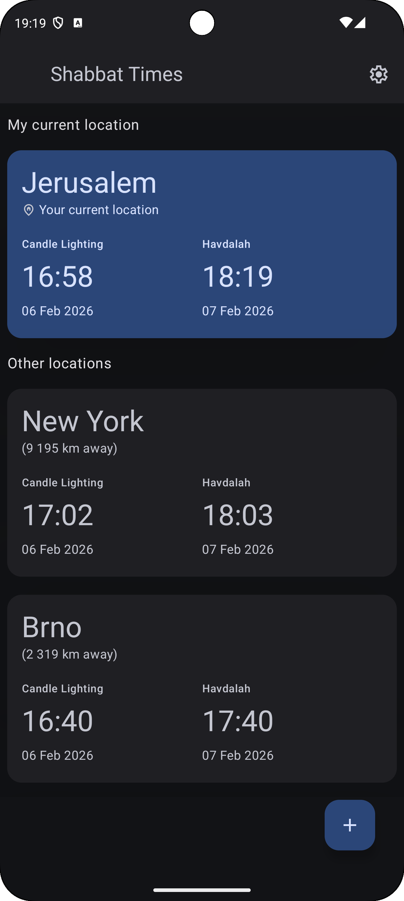
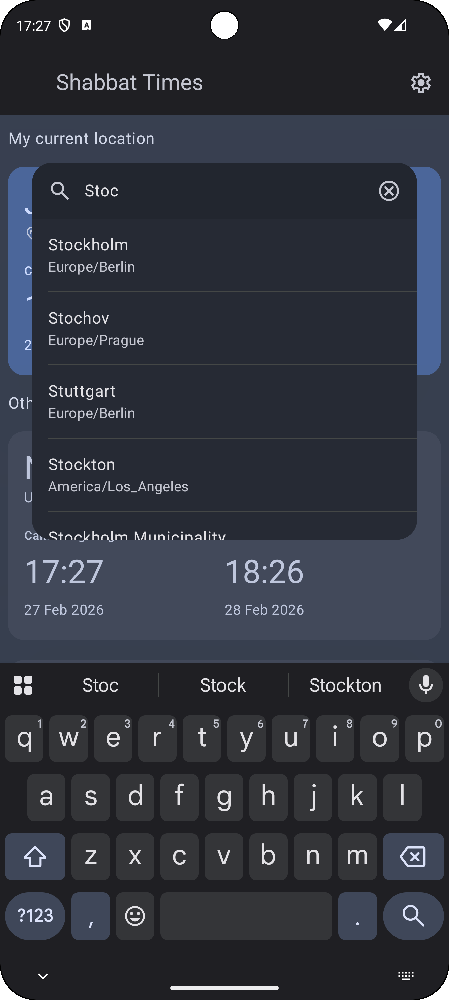
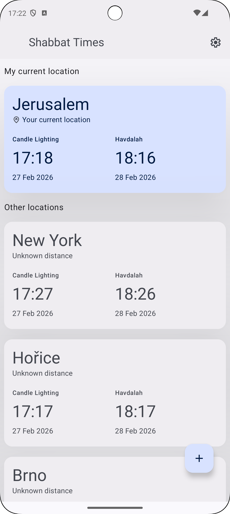
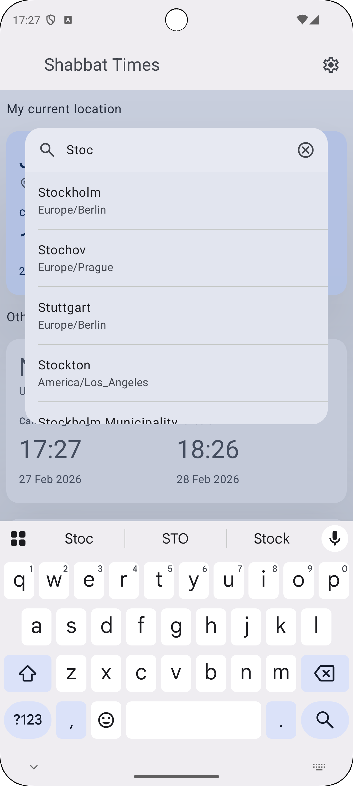

An Android app built with Jetpack Compose, Kotlin Coroutines, and MVI, focused on demonstrating
modern Android architecture and state management.
The app explores different architectural patterns for educational purposes, and intentionally applies some
over-engineered solutions to showcase design trade-offs and scalability.

## Table of Contents

1. [shabbat times app](#1--shabbat-app)
    1. [Current State of the App](#-current-state-of-the-app)
    2. [Future Work](#-future-work)
2. [MVI Architecture Overview](#2--mvi-architecture-overview)
    1. [MVI Terminology Mapping](#mvi-terminology-mapping)
3. [Navigation](#3--navigation)
4. [Permissions Management](#4--permissions-management)
5. [Search Architecture](#5--search-architecture)

---

## 1. 🕯 shabbat times app

### 📖 Overview

The Shabbat App is a lightweight, single-screen application that displays the upcoming
candle-lighting time and Havdalah time based on accurate solar data.
It automatically computes these times using real-world sunset data fetched via a public REST API and
applies the appropriate halachic offsets (+42 min / −18 min).

### 📸 Screenshots

- Screenshots reflect the current UI direction.
- Some interactions and data flows are still under active development.

<p align="start">
  
  
  
  
</p>

---

### 🏛️ Architecture

The app is built using modern Android architecture principles and libraries:

#### 🔵 1. UI — Jetpack Compose

- Example:

```kotlin
@Composable
fun ShabbatScreen() {
    val shabbatViewModel: ShabbatViewModel = hiltViewModel()
    val shabbatState by shabbatViewModel.state.collectAsStateWithLifecycle()

    val searchViewModel: SearchViewModel = hiltViewModel()
    val searchUiState by searchViewModel.state.collectAsStateWithLifecycle()

    HandlePermissions(
        permissions = listOf(
            Manifest.permission.ACCESS_FINE_LOCATION,
            Manifest.permission.ACCESS_COARSE_LOCATION,
        ),
        permissionState = shabbatState.permission,
        dispatch = shabbatViewModel::dispatch,
    )

    val context = LocalContext.current

    when (val halachicTimes = shabbatState.data) {
        is ShabbatResultState.Idle      -> LoadingScreen()

        is ShabbatResultState.Loading   -> LoadingScreen()

        is ShabbatResultState.NoResults -> LoadingScreen()

        is ShabbatResultState.Results   -> {
            val suggestions = searchUiState.suggestionsOrEmpty()
            val searchActive = searchUiState.isSearchActive()
            val hasQuery = searchUiState.hasQuery()

            ShabbatContent(
                halachicTimesDisplay = halachicTimes.data,
                shabbatDispatch = shabbatViewModel::dispatch,

                suggestions = suggestions,
                hasQuery = hasQuery,
                searchActive = searchActive,
                searchDispatch = searchViewModel::dispatch,
            )
        }

        is ShabbatResultState.Failure   -> FailureScreen(
            message = halachicTimes.message,
            onRetry = { shabbatViewModel.dispatch(ShabbatDataEvent.RetryLoadTimes) },
        )
    }

    LaunchedEffect(Unit) {
        searchViewModel.effects.collect { effect ->
            when (effect) {
                is AppEffect.ShowToast -> {
                    if (Debug.enabled) { Log.d("ShabbatScreen", "Toast: $effect ${effect.message}") }
                    Toast.makeText(context, effect.message, Toast.LENGTH_SHORT).show()
                }

                else -> Unit
            }
        }
    }

    LaunchedEffect(Unit) {
        shabbatViewModel.effects.collect { effect ->
            when (effect) {
                is AppEffect.OpenAppSettings -> {
                    if (Debug.enabled) { Log.d("ShabbatScreen", "OpenAppSettings: $shabbatState") }
                    context.openAppSettings()
                }

                else -> Unit
            }
        }
    }
}
```

#### 🔵 2. DI — Dagger Hilt

#### 🔵 3. ViewModel — MVI

- MVI

```kotlin
@HiltViewModel
class ShabbatViewModel @Inject constructor(
    private val shabbatRepository: ShabbatRepository,
    private val cityRepository: CityRepository,
) : ViewModel() {
    private val _effects: MutableSharedFlow<AppEffect> = MutableSharedFlow(extraBufferCapacity = 20)
    val effects: SharedFlow<AppEffect> = _effects.asSharedFlow()

    @OptIn(ExperimentalCoroutinesApi::class)
    val halachicTimesFlow: StateFlow<List<HalachicTimesDisplay>> =
        cityRepository.cities
            .flatMapLatest { cities ->
                cities.takeUnless { it.isEmpty() }
                    ?.let { nonEmptyCities ->
                        flow {
                            val results = shabbatRepository.getHalachicTimes(nonEmptyCities)
                            val successes = mutableListOf<HalachicTimesDisplay>()

                            results.forEach { result ->
                                result
                                    .onSuccess(tag = "ShabbatVM") { halachicTimesDisplay ->
                                        successes.add(halachicTimesDisplay)
                                    }
                                    .onFailure(tag = "ShabbatVM") { e ->
                                        _effects.tryEmit(value = AppEffect.ShowToast(message = "Network failed"))
                                    }
                            }
                            emit(value = successes)
                        }
                    } ?: flowOf(emptyList())
            }
            .catch {throwable ->
                _effects.tryEmit(value = AppEffect.ShowToast(message = "Unexpected error: ${throwable.message}"))
                emit(value = emptyList())
            }
            .stateIn(
                scope = viewModelScope,
                started = SharingStarted.WhileSubscribed(5000),
                initialValue = emptyList(),
            )

    private val _state: MutableStateFlow<ShabbatUiState> =
        MutableStateFlow(value = ShabbatUiState())

    val state: StateFlow<ShabbatUiState> = combine(
        flow = _state,
        flow2 = halachicTimesFlow,
    ) { state, halachicTimes ->
        ShabbatDataEvent.TimesLoaded(halachicTimes).reducer reduce state
    }
        .stateIn(
            scope = viewModelScope,
            started = SharingStarted.WhileSubscribed(5000),
            initialValue = ShabbatUiState(),
        )

    fun dispatch(event: AppEvent) {
        _state.update { current ->
            when (event) {
                is ShabbatDataEvent -> event.reducer reduce current
                is PermissionEvent  -> event.reducer reduce current
                is LocationEvent    -> event.reducer reduce current
                else                -> current
            }
        }

        when (event) {
            is PermissionEvent.RequestedAppSettings -> _effects.tryEmit(AppEffect.OpenAppSettings)
            else                                    -> Unit
        }
    }
}
```

#### 🔵 4. Networking — OkHttp + Retrofit

- Example:
  ```kotlin
  @Provides
  @Singleton
  fun provideRetrofit(): Retrofit {
      val client = OkHttpClientFactory.create(Debug.enabled)
      val contentType = "application/json".toMediaType()

      return Retrofit.Builder()
          .baseUrl(BASE_SUNRISE_SUNSET)
          .client(client)
          .addConverterFactory(JsonConfig.json.asConverterFactory(contentType))
          .build()
  }
  ```

#### 🔵 5. Data Layer — Clean architecture with repository abstraction

```kotlin
interface ShabbatRepository {
    suspend fun getSolarTimes(date: LocalDate, city: City): NetworkResult<SolarTimes>
    suspend fun getHalachicTimes(city: City): NetworkResult<HalachicTimesDisplay>
    suspend fun getHalachicTimes(cities: List<City>): List<NetworkResult<HalachicTimesDisplay>>
}
```

```kotlin
interface CityRepository {
    val cities: Flow<List<City>>
    suspend fun addCity(city: City)

    suspend fun geocodeAutocomplete(query: String): NetworkResult<List<City>>
    suspend fun geocodeForward(query: String): NetworkResult<City?>
    suspend fun geocodeReverse(latitude: Double, longitude: Double): NetworkResult<City?>
}
```

#### 🔵 6. KotlinX Serialization — For DTO parsing

#### 🔵 7. Domain Layer — Strongly typed models (LocalDate, LocalTime)

### 🌅 Solar Times API

The app uses the public API at https://sunrisesunset.io/ to fetch daily solar times (primarily
sunset).
The default location is currently Jerusalem, but dynamic user location is on the roadmap.

#### 🟢 1. Example API response (trimmed for relevance):

```kotlin
{
    "results": {
    "date": "2025-04-12",
    "sunset": "11:56:00 AM"
},
    "status": "OK"
}
```

#### 🟢 2. Retrofit endpoint definition:

```kotlin
@GET("json")
suspend fun getSolarTimes(
    @Query("lat") lat: Double = Cities.JERUSALEM.lat,
    @Query("lng") lng: Double = Cities.JERUSALEM.lng,
    @Query("timezone") timezone: String = Cities.JERUSALEM.timezone,
    @Query("time_format") timeFormat: Int = 24,
    @Query("date") date: String? = null,
): SolarTimesDto
```

```kotlin
    @GET("autocomplete")
suspend fun autocomplete(
    @Query("text") queryText: String,
    @Query("filter") countryFilter: String? = null,
    @Query("type") resultType: String? = "city",

    @Query("limit") maxResults: Int = 5,
    @Query("lang") preferredLanguage: String = Locale.getDefault().language,
    @Query("format") format: String = "json",
    @Query("apiKey") apiKey: String = BuildConfig.GEOAPIFY_API_KEY,
): GeoapifyResponseDto
```

#### 🟢 3. DTO and domain mapping:

```kotlin
@Serializable
data class SolarTimesResponseDto(
    val results: SolarTimesResultDto = SolarTimesResultDto(),
    val status: String = "",
)

@Serializable
data class SolarTimesResultDto(
    val date: String = "",
    val sunset: String = "",
)

@Serializable
data class GeoapifyResponseDto(
    val results: List<GeoapifyResultDto>? = null,
    val status: String? = null,
    val query: GeoapifyQuery? = null
)

@Serializable
data class GeoapifyResultDto(
    @SerialName("lat") val latitude: Double? = null,
    @SerialName("lon") val longitude: Double? = null,
    val timezone: GeoapifyTimezone? = null,
// ...
)
```

#### 🟢 4. The repository fetches specific solar times for:

- upcoming Friday → used to compute candle lighting.
- upcoming Saturday → used to compute Havdalah.
  ```kotlin
  fun upcomingCandleLightingDate(): LocalDate = now().nextOrTodayDayOfWeek(DayOfWeek.FRIDAY)
  fun upcomingHavdalahDate(): LocalDate = now().nextOrTodayDayOfWeek(DayOfWeek.SATURDAY)
  
  fun LocalDate.nextOrTodayDayOfWeek(target: DayOfWeek): LocalDate { ... }
  ```

### 🕒 Halachic Times

Halachic times (zmanim) represent meaningful moments defined in Jewish law.

#### 🟡 1. Two key calculations are implemented:

These represent widely used halachic opinions, but other variants may be introduced later:

- Candle Lighting — 18 minutes before Friday sunset.
- Offset constant: HILUCH_MIL_MINUTES = 18L.


- Havdalah — 42 minutes after Saturday sunset.
- Offset constant: TZEIT_HAKOCHAVIM_MINUTES = 42L.

#### 🟡 2. Domain model

```kotlin
data class HalachicTimes(
    val candleLightingTime: LocalTime,
    val candleLightingDate: LocalDate,
    val havdalahTime: LocalTime,
    val havdalahDate: LocalDate,
)
```

#### 🟡 3. Display model (used only by UI):

```kotlin
data class HalachicTimesDisplay(
    val candleLightingTime: String = "",
    val candleLightingDate: String = "",
    val havdalahTime: String = "",
    val havdalahDate: String = "",
)
```

#### 🟡 4. Conversions are done via extensions:

```kotlin
fun HalachicTimes.toDisplay(context: Context): HalachicTimesDisplay
```

### 👤 User Preferences

#### 🔴 1. Current version uses a hard-coded Jerusalem location, but the architecture anticipates:

- dynamic device location
- user-selectable city presets
- multiple zmanim opinions

#### 🔴 2. User preferences include:

- 12/24-hour clock awareness, via UserPreferences.is24HourFormat().

### 📅 Date & Time Handling

#### 🟣 1. To ensure accuracy and avoid parsing issues:

- All DTO fields (strings) are immediately converted into LocalDate and LocalTime domain objects.
- Calculations (± minutes) are performed only on strongly typed data.
- Formatting back to strings happens only at UI-binding time.

#### 🟣 2. Examples:

```kotlin
val API_DATE_PARSER = DateTimeFormatter.ISO_LOCAL_DATE
val API_TIME_PARSER_24 = DateTimeFormatter.ISO_LOCAL_TIME
val HEBREW_DATE_FORMATTER = DateTimeFormatter.ofPattern(HEBREW_DATE_PATTERN)
```

#### 🟣 3. Utility extensions include:

```kotlin
fun LocalDate.nextOrTodayDayOfWeek(target: DayOfWeek): LocalDate
fun upcomingCandleLightingDate(): LocalDate
fun upcomingHavdalahDate(): LocalDate
fun LocalTime.toDisplayString(context: Context): String
fun LocalDate.toDisplayString(): String
```

### 🏁 Current State of the App

#### 🟠 1. The app currently includes:

- Initial Shabbat screen with:
    - Hardcoded Jerusalem location
    - Candle lighting date & time
    - Havdalah date & time
    - Fully functional REST API integration
    - Domain-accurate halachic time calculations
    - Strong type-safety with Kotlin time models
    - First stable working implementation
    - City Autocomplete search

### 🔜 Future Work

#### ⚫ 1. Planned improvements:

- Dynamic user location.
- Multiple halachic opinions (e.g., 40/72 minutes).
- Offline caching of zmanim.

---

## 2. 🔄 MVI Architecture Overview

This project follows pure unidirectional MVI with a few naming choices that avoid Android-specific
confusion (e.g., "Event" instead of "Intent").

### Core MVI Concepts

- **AppState**  
  Single immutable source of truth. A data class that combines all feature-specific sub-states.

- **AppEvent**  
  Represents user intentions or external triggers. Implemented as a sealed hierarchy.  
  Each event is **self-reducing**: it carries its own pure reducer via the `Reducible<S>` interface.

    - **Reducer**  
      A pure function `(oldState: S) → newState: S` that computes the next sub-state.  
      Completely side-effect-free.

    - **Reducible&lt;S&gt;**  
      A marker interface that events implement to declare:  
      *"I know how to reduce a specific sub-state of type S."*  
      This enables the clean, boilerplate-free pattern where events reduce themselves.

- **AppEffect**  
  Represents imperative, one-shot side effects that cannot be expressed purely (e.g., starting
  background loops, network requests, showing toasts, navigation, logging).

## Data Flow

### Pure MVI Cycle (Concise)

```kotlin
cityRepository.cities → halachicTimesFlow
→ repository called reactively
→ results mapped to Events (TimesLoaded / TimesLoadFailed)
→ combined with _state → new ShabbatUiState
→ UI observes StateFlow → renders automatically
```

### Step-by-Step

1. User Interaction

- UI calls viewModel.dispatch(event) (e.g. RetryLoadTimes)

2. Pure State Reduction

- The event’s reducer produces a new immutable UiState
- The ViewModel updates its internal StateFlow

3. Reactive Triggers

- One or more Flows (combine, flatMapLatest, etc.) observe relevant parts of the state
- These Flows automatically react to the new state

4. Asynchronous Work

- Repository calls are triggered reactively inside Flows
- Results are mapped to domain/UI models


- halachicTimesFlow observes cityRepository.cities.
- For each new list of cities, the repository is called automatically.
- Success/failure results are dispatched to _state via events (TimesLoaded, TimesLoadFailed).
- The final state is a combination of _state + halachicTimesFlow.
- UI observes state directly — no explicit effect collection coroutine is required.

5. State Feedback

- Repository results are transformed into new Events (e.g. TimesLoaded, TimesLoadFailed)
- Reducers update the state again

6. UI Update
- Compose observes the new state and recomposes automatically

  ```kotlin
  fun dispatch(event: AppEvent) {
        _state.update { current ->
            when (event) {
                is ShabbatDataEvent -> event.reducer reduce current
                is PermissionEvent  -> event.reducer reduce current
                is LocationEvent    -> event.reducer reduce current
                else                -> current
            }
        }

        when (event) {
            is PermissionEvent.RequestedAppSettings -> _effects.tryEmit(AppEffect.OpenAppSettings)
            else                                    -> Unit
        }
  }
  ```

### In Plain English

- The user does something → an Event is created and sent to the ViewModel.
- The Event knows exactly how to calculate the new State (pure, no side effects).
- The ViewModel updates the State → the UI refreshes automatically.
- If something “real” needs to happen (load data, show a toast), the ViewModel sends an Effect.
- One permanent listener in the ViewModel catches all Effects and performs the actual work.
- That work can create new Events, keeping everything flowing in one direction.
- This unidirectional, pure MVI flow ensures predictability, testability, and easy reasoning about application behavior.

### MVI Terminology Mapping

| Project Term      | Common MVI Equivalent           | Notes                                                                                                                                                                                        |
|-------------------|---------------------------------|----------------------------------------------------------------------------------------------------------------------------------------------------------------------------------------------|
| Event             | Intent / Action                 | User intention or external trigger that drives state change                                                                                                                                  |
| State             | State / Model                   | Single immutable source of truth for the UI                                                                                                                                                  |
| Effect            | Effect / SideEffect / Command   | Imperative one-shot actions (network, start loop, toast)                                                                                                                                     |
| dispatch          | send / accept / dispatch        | Public entry point to send an Event into the ViewModel                                                                                                                                       |
| Reducer           | Reducer (central function)      | Pure function: (oldState, event) → newState (or sub-state)                                                                                                                                   |
| Reducible         | no direct equivalent            | Marker interface saying "this Event carries its own reducer". Also known as self-reducing events, reducer-carrying actions, or fat actions. Avoids central when switch — clean and scalable. |
| Event + Reducible | Central when (event) in reducer | preferred variant for readability and no boilerplate                                                                                                                                         |

### Why separate Events from Effects?

- `Events` are declarative: "I want to load Shabbat times", "Start breathing".
    - They only describe intent and how the state should change.
- `Effects` are reactive:
    - Async work (network, disk, permissions) is triggered by observing state or repository flows
    - This work lives in Flows (flatMapLatest, combine, etc.), not inside reducers

### Benefits

- Unidirectional data flow ensures predictability and traceability
- Pure reducers → easy unit testing (event → state)
- Side effects are driven by state, not by imperative commands
- Async work is lifecycle-aware and cancelable by default
- No hidden behavior: everything reacts to explicit state changes
- Scales naturally as new Flows are added (data, permissions, location, analytics)

### Example: Shabbat loading

1. ViewModel observes cities (cityRepository.cities) as a Flow.
2. For each change in cities, halachicTimesFlow triggers:
   - If cities are empty → emits emptyList().
   - If cities are present → calls shabbatRepository.getHalachicTimes(cities).
   - Maps each result to a NetworkResult and dispatches TimesLoaded or TimesLoadFailed events to _state.
3. halachicTimesFlow emits a list of successful HalachicTimesDisplay.
4. State is derived by combining _state + halachicTimesFlow:

```kotlin
val state: StateFlow<ShabbatUiState> = combine(
        flow = _state,
        flow2 = halachicTimesFlow,
    ) { state, halachicTimes ->
        ShabbatDataEvent.TimesLoaded(halachicTimes).reducer reduce state
    }
        .stateIn(
            scope = viewModelScope,
            started = SharingStarted.WhileSubscribed(5000),
            initialValue = ShabbatUiState(),
        )
```

- This means the final ShabbatUiState always contains the latest halachic times, automatically updated when either _state or halachicTimesFlow changes.

5. UI observes state with collectAsStateWithLifecycle() and updates automatically — no explicit effect collector needed.

Notes:
- No explicit “LoadData” effect is required.
- The state is fully reactive: adding/removing cities automatically triggers new repository calls and UI updates.
- Failures are propagated via the same reactive flow and can be handled in the UI.

---

## 3. 🧭 Navigation

A **type-safe, scalable, testable, and production-proven** navigation system built for modern
Android apps using Jetpack
Compose + Navigation + Hilt + Kotlin Serialization.

### 🏛️ Core Principles

| Principle                      | Implementation & Benefit                                                                            |
|--------------------------------|-----------------------------------------------------------------------------------------------------|
| **Reusable UI**                | No `NavController` in UI → UI components stay dumb and reusable                                     |
| **Type-safe**                  | Sealed interfaces + `@Serializable` + `hasRoute<T>()` → no strings, no crashes                      |
| **flows through `NavManager`** | All navigation goes through `NavManager` No other class talks to `NavController` or reads backstack |
| **Modular & scalable**         | Separate graph functions per feature → easy to maintain, test, and extend                           |
| **Deep link safe**             | Full support out of the box — no extra code needed                                                  |
| **Testable**                   | `NavManager` is Hilt-injectable singleton → easy to mock in unit & UI tests                         |

### 🏛️ Core Components

| Component          | Responsibility                                                                             |
|--------------------|--------------------------------------------------------------------------------------------|
| 1. `NavTarget`     | Sealed hierarchy of **all app destinations** — the heart of type-safe navigation           |
| 2. `NavItem`       | Visual + behavioral representation of a navigation item (icon, title, badge, role)         |
| 3. `NavRole`       | Defines where the item appears: bottom tab, top navigation, action button, etc.            |
| 4. `NavAction`     | Sealed class representing navigation commands (`To`, `Up`, `ResetTo`, etc.)                |
| 5. `NavManager`    | Singleton brain: emits commands, exposes current destination, fully injectable             |
| 6. `*.NavGraph.kt` | Feature-isolated graph builders (`authNavGraph`, `bottomNavGraph`, `alertsNavGraph`, etc.) |
| 7. `NavApp`        | Root composable — the **only** place that talks to `NavController`                         |
| 8. UI Components   | `NavBarBottom`, `NavBarTop`, `NavBarIcon`, ... — pure UI, zero navigation logic            |

### 🔵 1. NavTarget — Type-Safe Destinations

- The **foundation** of the entire system.
- No string routes. No `::class.qualifiedName`. No reflection.
- Uses Jetpack Navigation’s `hasRoute<T>()` → **100% compile-safe and R8-safe**.

```kotlin
@Serializable
sealed interface NavTarget {
    companion object {
        fun NavBackStackEntry?.fromBackStackEntry(): NavTarget? {
            return when {
                this?.destination?.hasRoute<NavTargetTop.Settings>() == true   -> NavTargetTop.Settings
                this?.destination?.hasRoute<NavTargetTop.Previous>() == true   -> NavTargetTop.Previous

                this?.destination?.hasRoute<NavTargetBottom.Shabbat>() == true -> NavTargetBottom.Shabbat
                else                                                           -> null
            }
        }
    }
}

@Serializable
sealed interface NavTargetTop : NavTarget {
    @Serializable object Previous : NavTargetTop
    @Serializable object Settings : NavTargetBottom
}
```

### 🔵 2. NavItem - Navigation UI Metadata

- Encapsulates everything needed to render a navigation item in bottom bar, or top bar.

```kotlin
data class NavItem(
    val target: NavTarget,
    val title: String?,
    val selectedIcon: UiIcon,
    val unselectedIcon: UiIcon,
    val role: NavRole,
)

object NavItems {

    val Settings = NavItem(
        target = NavTargetTop.Settings,
        title = "Settings",
        selectedIcon = UiIcon.Resource(R.drawable.settings_filled_24),
        unselectedIcon = UiIcon.Resource(R.drawable.settings_outlined_24),
        role = NavRole.TOP_ACTION,
    )
    // ...
}
```

### 🔵 3. NavRole - Placement & Behavior

- Defines where and how a NavItem should be displayed.

```kotlin
enum class NavRole {
    BOTTOM_TAB,
    TOP_NAVIGATION,
    TOP_ACTION,
    // ...
}
```

### 🔵 4. NavAction - Navigation Commands

- Sealed hierarchy of all possible navigation actions.
- Emitted by NavManager, consumed only by NavApp.
- navOptions: NavOptionsBuilder.() -> Unit enabling customization of navigation behavior.
- Applied sensible defaults.

```kotlin
sealed interface NavAction {

    data class To(
        val target: NavTarget,
        val navOptions: NavOptionsBuilder.() -> Unit = {
            launchSingleTop = true
            restoreState = true
        }
    ) : NavAction

    data class ResetTo(
        val target: NavTarget,
        val navOptions: NavOptionsBuilder.() -> Unit = {
            popUpTo(0) { inclusive = true }
            launchSingleTop = true
        }
    ) : NavAction

    data class PopTo(
        val target: NavTarget,
        val navOptions: NavOptionsBuilder.() -> Unit = { }
    ) : NavAction

    data object Up : NavAction
    data object PopToRoot : NavAction
}
```

### 🔵 5. NavManager - The Brain

- Singleton injected via Hilt.
- Only source of navigation commands and current destination.
    - Only NavApp calls updateCurrentTarget() → one-way data flow
    - All UI and ViewModels use navigateTo(), resetRoot(), etc.

```kotlin
@Singleton
class NavManager @Inject constructor() {
    private val _commands = MutableSharedFlow<NavAction>(extraBufferCapacity = 1)
    val commands = _commands.asSharedFlow()

    private val _currentTarget = MutableStateFlow<NavTarget?>(value = null)
    val currentTarget = _currentTarget.asStateFlow()

    internal fun updateCurrentTarget(target: NavTarget?) {
        _currentTarget.value = target
    }

    fun navigateTo(target: NavTarget) = _commands.tryEmit(NavAction.To(target))
    fun navigateUp() = _commands.tryEmit(NavAction.Up)
    fun resetRoot(target: NavTarget) = _commands.tryEmit(NavAction.ResetTo(target))
    fun popTo(target: NavTarget) = _commands.tryEmit(NavAction.PopTo(target))
    fun popToRoot() = _commands.tryEmit(NavAction.PopToRoot)
}
```

### 🔵 6. NavGraph — Modular & Clean

- Navigation graphs are pure functions — no @Composable, no navController passed around.

```kotlin
fun NavGraphBuilder.mainNavGraph(navigator: Navigator) {
    composable<NavTargetBottom.Shabbat> {
        ShabbatScreen()
    }

    composable<NavTargetTop.Settings> {
        FailureScreen(message = "Coming Soon") {
            navigator.navigateUp()
        }
    }
}
```

### 🔵 7. NavApp — The Bridge

- The only place that touches NavController.
- Syncs real navigation state → NavManager.

```kotlin
@Composable
fun NavApp(
    modifier: Modifier,
    state: AppModel,
    onEvent: (AppEvent) -> Unit,
    navigator: Navigator,
) {
    val navController = rememberNavController()
    val currentBackStackEntry by navController.currentBackStackEntryAsState()

    LaunchedEffect(currentBackStackEntry) {
        navigator.syncBackStackWithNavigator(currentBackStackEntry)
    }

    LaunchedEffect(Unit) {
        navigator.collectNavigationCommands(navController)
    }

    val startDestination = NavTargetBottom.Home

    NavHost(
        modifier = modifier,
        navController = navController,
        startDestination = startDestination,
    ) {
        mainNavGraph(
            state = state,
            onEvent = onEvent,
        )
    }

    if (Debug.enabled) {
        LaunchedEffect(navController) {
            navController.addOnDestinationChangedListener { controller, destination, arguments ->
                Log.d(
                    "navController",
                    "Current destination: ${navController.currentDestinationName()}"
                )
            }
        }
    }
}
```

### 🔵 8. UI Components Pure & Reusable

- Zero knowledge of NavController. Zero strings.

```kotlin
@Composable
fun NavBarIcon(
    isSelected: Boolean,
    item: NavItem,
    badgeCount: Int? = null,
) {
    BadgedBox(badge = { NavBarBadge(badgeCount) }) {
        UiIconImage(
            icon = if (isSelected) item.selectedIcon else item.unselectedIcon,
            contentDescription = item.title,
        )
    }
}

@Composable
fun NavBarBadge(count: Int? = null) {
    val displayCount = count?.takeIf { it > 0 } ?: return

    Badge(
        containerColor = MaterialTheme.colorScheme.tertiary,
        contentColor = MaterialTheme.colorScheme.onTertiary,
    ) {
        Text(text = if (displayCount > 99) "99+" else displayCount.toString())
    }
}

@OptIn(ExperimentalMaterial3Api::class)
@Composable
fun NavBarTop(
    navItems: List<NavItem>,
    navigator: Navigator,
    currentNavTarget: NavTarget? = null,
    scrollBehavior: TopAppBarScrollBehavior,
) {
    val (topNavigationItem, topActionItems) = navItems.extractTopBarItems()

    TopAppBar(
        colors = TopAppBarColors(
            containerColor = MaterialTheme.colorScheme.surfaceContainer,
            scrolledContainerColor = MaterialTheme.colorScheme.surfaceContainer,
            navigationIconContentColor = MaterialTheme.colorScheme.onSurfaceVariant,
            titleContentColor = MaterialTheme.colorScheme.onSurfaceVariant,
            actionIconContentColor = MaterialTheme.colorScheme.onSurfaceVariant,
            subtitleContentColor = MaterialTheme.colorScheme.onSurfaceVariant,
        ),
        title = { Text(text = currentNavTarget?.simpleName() ?: "None") },
        navigationIcon = {
            topNavigationItem?.let {
                IconButton(onClick = { navigator.navigateUp() }) {
                    NavBarIcon(
                        isSelected = currentNavTarget == it.target,
                        badgeCount = null,
                        item = it,
                    )
                }
            }
        },
        actions = {
            topActionItems.forEach { item ->
                val onItemClick = { navigator.navigateTo(item.target) }

                IconButton(onClick = { onItemClick() }) {
                    NavBarIcon(
                        isSelected = currentNavTarget == item.target,
                        badgeCount = null,
                        item = item,
                    )
                }
            }
        },
        scrollBehavior = scrollBehavior
    )
}
```

---

## 4. 🚦 Permissions Management

- The code implements a robust permission system for requesting and managing Android permissions, specifically fine and coarse location access.
- This is crucial for the app to fetch the user's location and calculate accurate Shabbat times.

### Key Features

- Checks whether required permissions are already granted (avoids unnecessary requests)
- Launches the native Android permission dialog only when needed

- Correctly distinguishes between:
    - temporary denials (shows rationale dialog)
    - permanent denials ("Don't ask again" / multiple denials → guides to app settings)

- Fully asynchronous using Kotlin coroutines (`suspend` functions) — no UI blocking
- Clean state management with sealed interfaces (`PermissionState`, `PermissionResult`, `PermissionEvent`) + reducers

- Provides user-friendly in-app explanations and retry / settings navigation flows
- Reusable abstraction (`PermissionHandler` interface) — easy to adapt for camera, storage, notifications, etc.
- Built-in debug logging and permission status checks

### Core Components

| Component                 | Role                                                                       | Type               |
|---------------------------|----------------------------------------------------------------------------|--------------------|
| PermissionHandler         | Suspendable API to request permissions and handle result callbacks         | Interface + Impl   |
| PermissionResult          | Domain-level outcome of a permission request (what happened)               | Sealed interface   |
| PermissionState           | UI/presentation state (what to show right now: dialog, nothing, etc.)      | Sealed interface   |
| PermissionEvent           | User/system intents and results that drive state transitions               | Sealed interface   |
| HandlePermissions         | Composable orchestrator: reacts to state, shows dialogs, triggers requests | Composable         |
| rememberPermissionHandler | Creates and remembers the handler + ActivityResultLauncher                 | Composable factory |

### High-Level Flow

1. User triggers a request in Composable (`ShabbatScreen`)
2. The app checks the current permission state. (`HandlePermissions`)
3. If not granted, it triggers a dialog. (`ExplanatoryDialog`)
4. Based on the user's response, it updates the state (granted, denied with rationale, or permanently denied).
5. Dialogs guide the user on next steps.
6. Events are dispatched to a ViewModel, which updates the app's state and may trigger effects (e.g., loading data or opening settings).

### Visualized Flow

```markdown
Start
│
└─ 👤 Requests (ShabbatViewModel.dispatcher)
   │
   ├─ event Request ─ state Requesting
   │
   └─ 🤖 The `HandlePermissions` composable uses `rememberPermissionHandler` to check whether the permissions are already granted.
      │
      ├─ Yes
      │  └── result Granted ─ event AllGranted ─ state Granted ✅
      │
      └─ No (Launch system dialog 💬)
         │
         ├─ 👤 Allows all 
         │  └── result Granted ─ event AllGranted ─ state Granted ✅
         │
         └─ 👤 Denies (Show rationale dialog 💬)
            │
            └── result Explain ─ event DeniedWithRationale ─ state Denied ❗
                       │
                       ├─ 👤 Allows  
                       │  └── event AcceptedRationale ─ state Requesting
                       │
                       ├─ 👤 Cancels
                       │  └── event DismissedRationale ─ state Idle ❌❗
                       │
                       └─ 👤 Denies 💬 (Show "go to settings" dialog)
                          │
                          └── result Blocked ─ event DeniedPermanently ─ state DeniedPermanently 🚫
                                     │
                                     ├─ 👤 Opens settings
                                     │  └── event RequestedAppSettings ─ state Idle ─ effect OpenAppSettings ✨
                                     │
                                     └─ 👤 Cancels
                                        └── event DismissedRationale ─ state Idle ❌🚫
```

### Structured Components

- The code is modular, divided into interfaces, classes, composables, and sealed hierarchies. Below is a breakdown by component.

#### 🟢 1. PermissionHandler Interface

- Definition: A simple interface for requesting permissions asynchronously.
- Key Method: suspend fun request(permissions: List<String>): PermissionResult
- Takes a list of permission strings (e.g., Manifest.permission.ACCESS_FINE_LOCATION).
- Returns a PermissionResult (sealed interface: Granted, Explain, or Blocked).

- This acts as the entry point for permission requests.

#### 🟢 2. PermissionHandlerImpl Class

- Dependencies:
    - isGranted: Lambda to check if a permission is already granted (uses ContextCompat.checkSelfPermission).
    - shouldShowRationale: Lambda to check if a rationale should be shown (uses ActivityCompat.shouldShowRequestPermissionRationale).
    - launch: Lambda to start the permission request dialog (via ActivityResultLauncher).

- Internal State: A CancellableContinuation to handle coroutine suspension and resumption.

- request() Function:
    - Uses suspendCancellableCoroutine to pause until the result is available.
    - Filters out already granted permissions.
    - If all are granted, resumes immediately with Granted.
    - Otherwise, launches the request and waits.

- onResult() Function:
    - Called when the system returns permission results (a map of permission to boolean granted status).
    - Categorizes results: granted, denied, permanently denied.
    - Resumes the coroutine with the appropriate PermissionResult.
    - Clears the continuation to allow future requests.

- This class bridges the Android permission API with coroutines.

```kotlin
class PermissionHandlerImpl(
    private val isGranted: (String) -> Boolean,
    private val shouldShowRationale: (String) -> Boolean,
    private val launch: (Array<String>) -> Unit,
) : PermissionHandler {
    private var continuation: CancellableContinuation<PermissionResult>? = null

    override suspend fun request(permissions: List<String>): PermissionResult =
        suspendCancellableCoroutine { cont ->
            check(continuation == null) { "Permission request already in progress" }

            val missing = permissions.filterNot(isGranted)

            if (missing.isEmpty()) {
                cont.resume(PermissionResult.Granted)
                return@suspendCancellableCoroutine
            }

            continuation = cont
            launch(missing.toTypedArray())

            cont.invokeOnCancellation {
                continuation = null
            }
        }

    fun onResult(result: Map<String, Boolean>) {
// ...
    }
}
```

#### 🟢 3. rememberPermissionHandler Composable

- Purpose: Creates and remembers a PermissionHandlerImpl instance in Compose.
- Key Elements:
    - Uses rememberLauncherForActivityResult with RequestMultiplePermissions contract to handle permission callbacks.
    - Initializes the handler with context-specific lambdas for checking grants and rationale.

- Returns: The PermissionHandler instance, memoized for recomposition efficiency.

- This makes the handler Compose-aware and lifecycle-safe.

```kotlin
@Composable
fun rememberPermissionHandler(): PermissionHandler {
    val context = LocalContext.current
    lateinit var handler: PermissionHandlerImpl

    val launcher = rememberLauncherForActivityResult(
        contract = ActivityResultContracts.RequestMultiplePermissions()
    ) { result ->
        handler.onResult(result)
    }

    handler = remember(context, launcher) {
        PermissionHandlerImpl(
            isGranted = { perm ->
                ContextCompat.checkSelfPermission(
                    context,
                    perm
                ) == PackageManager.PERMISSION_GRANTED
            },
            shouldShowRationale = { perm ->
                val activity = context as Activity
                ActivityCompat.shouldShowRequestPermissionRationale(activity, perm)
            },
            launch = launcher::launch
        )
    }

    return handler
}
```

#### 🟢 4. HandlePermissions Composable

- Parameters:
    - permissions: List of permissions to request.
    - permissionState: Current PermissionState (from ViewModel).
    - dispatch: Function to send PermissionEvents to the ViewModel.

- Behavior:
    - Uses LaunchedEffect to request permissions when state is Requesting.
    - Based on result, dispatches events like AllGranted, DeniedWithRationale, or DeniedPermanently.

- Renders dialogs:
    - For Denied: Explains need for location and offers "Allow" (triggers re-request) or dismiss.
    - For DeniedPermanently: Prompts to open settings.

- Debug logging for permission status.

- This composable integrates the handler with UI feedback.

```kotlin
@Composable
fun HandlePermissions(
    permissions: List<String>,
    permissionState: PermissionState,
    dispatch: (PermissionEvent) -> Unit,
) {
    val permissionHandler = rememberPermissionHandler()
    val context = LocalContext.current

    LaunchedEffect(permissionState) {
        if (permissionState == PermissionState.Requesting) {
            val result = permissionHandler.request(permissions)

            when (result) {
                is PermissionResult.Granted ->
                    dispatch(PermissionEvent.AllGranted)

                is PermissionResult.Explain ->
                    dispatch(PermissionEvent.DeniedWithRationale)

                is PermissionResult.Blocked ->
                    dispatch(PermissionEvent.DeniedPermanently)
            }
        }
    }
// ...
}
```

#### 🟢 5. Sealed Interfaces

- PermissionState:
    - Idle: Init state.
    - Requesting: In progress.
    - Granted: All permissions approved.
    - Denied: Denied but can show rationale.
    - DeniedPermanently: User selected "Don't ask again" or denied multiple times.

- PermissionResult:
    - Granted: Success.
    - Explain(permissions): Denied, show why it's needed.
    - Blocked(permissions): Permanently denied.

- PermissionEvent:
    - Request: Start requesting.
    - AllGranted/DeniedWithRationale/DeniedPermanently: Update state based on result.
    - AcceptedRationale: User agrees after explanation, re-request.
    - DismissedRationale: User cancels, back to idle.
    - RequestedAppSettings: Open settings.
    - ReturnedFromAppSettings: Re-check after settings (triggers request).

- Each event includes a reducer lambda to update the app state immutably.

#### 🟢 6. Usage in ShabbatScreen Composable

- Injects ShabbatViewModel via Hilt.
- Collects state with collectAsStateWithLifecycle.
- Calls HandlePermissions with location permissions, current state, and dispatch function.
- Renders UI based on data state (e.g., loading screen).

- This shows integration in a real screen.

- See: [1. UI — Jetpack Compose](#-1-ui--jetpack-compose)

#### 🟢 7. ViewModel

- dispatch(event):
    - Updates _state using the event's reducer (for data, permission, or location events).
    - Emits effects for side actions (e.g., open settings).

- This centralizes state updates and effects.
- See: [3. ViewModel — MVI (and experimental MVVM)](#-3-viewmodel--mvi-and-experimental-mvvm)

---

## 5. 🔍︎ Search Architecture

The search functionality is designed as a reactive, modular system that bridges user input with the core calculation engine. It demonstrates a clean separation between generic UI components, domain-specific state wrappers, and optimized data fetching.

### Key Features

- **Atomic UI Design**: A three-tier hierarchy (Generic `SearchBarInputField` → Domain-Specific `CitySearchBarInputField` → `CitySearchScreen`) that ensures UI components remain stateless, reusable, and easy to test.
- **Self-Reducing MVI**: Search events implement `Reducible<SearchUiState>`, moving business logic into discrete, testable units (`SearchReducer`) and keeping the ViewModel as a clean orchestrator.
- **Robust State Wrappers**: Replaces primitive strings with `Input<T>` and `Selection<T>` types to explicitly model field states (Idle, Value, Loading, Empty), eliminating "null-checking hell" in the UI.
- **Reactive Data Pipeline**: Utilizes a reactive bridge where a city selection in the search module automatically triggers a data re-fetch in the halachic module via `flatMapLatest`.
- **Performance Optimized**: Features built-in 300ms debouncing, minimum query thresholds (2+ chars), and automatic geo-localization based on the user's system locale.
- **Smart UX Logic**: Encapsulates complex interactions, such as the dual-purpose trailing icon (Clear vs. Collapse), into isolated helper functions to maintain UI readability.

### Core Components

| Component               | Role                                                                                                                                                            | Type       |
|-------------------------|-----------------------------------------------------------------------------------------------------------------------------------------------------------------|------------|
| SearchBarInputField     | A generic, private composable that wraps SearchBarDefaults.InputField and provides a standard setup for text state, expansion, and search actions.              | Composable | 
| CitySearchBarInputField | A specialized, public composable that configures SearchBarInputField with specific defaults for city searching (placeholder text, icons, etc.).                 | Composable | 
| CitySearchScreen        | The main screen composable that orchestrates the search UI, manages state, and handles user events.                                                             | Composable |
| onTrailingIconClick     | A private helper function that determines the action for the trailing icon: clear the query if it exists, or toggle the search bar's expansion state otherwise. | Function   |

### High-Level Flow

This feature operates on a unidirectional data flow that spans from UI interactions to asynchronous network results:
1. Intent: The user types; the UI dispatches SearchEvent.QueryChanged.
2. State Reduction: The event’s reducer immediately updates the Input value in the ViewModel's private state.
3. Throttling: A reactive queryFlow observes the state, applying a 300ms debounce and filtering for distinctUntilChanged to prevent redundant API pressure.
4. Async Fetch: The suggestionsFlow uses flatMapLatest to trigger the CityRepository. If the query is < 2 characters, it short-circuits to an idle state.
5. Network Resilience: The Repository executes the geocoding request on Dispatchers.IO using runCatching, returning a NetworkResult.
6. State Synthesis: The UI state is a combine of the base UI state and the suggestionsFlow. Results are "reduced" back into the state via CitiesLoaded to maintain MVI purity.
7. Recomposition: CitySearchScreen observes the synthesized StateFlow and re-renders the suggestions panel automatically.

### Structured Components

#### 🔵 1. SearchBarInputField

A foundational, private composable that abstracts Material 3's SearchBarDefaults.InputField into a standardized, reusable component.
- Purpose: Encapsulates boilerplate configurations (shape, padding, text-field state logic) to ensure UI consistency across different search contexts while hiding implementation details.
- Contract: Exposes a clean API for state management and functional callbacks (onSearch, onExpandedChange).

```kotlin
@Composable
@OptIn(ExperimentalMaterial3Api::class, FlowPreview::class)
private fun SearchBarInputField(
    state: TextFieldState,
    expanded: Boolean,
    onSearch: (String) -> Unit,
    onExpandedChange: (Boolean) -> Unit,

    modifier: Modifier = Modifier,
    placeholder: @Composable (() -> Unit)?,
    leadingIcon: @Composable (() -> Unit)?,
    trailingIcon: @Composable (() -> Unit)?,
    shape: Shape = RoundedCornerShape(16.dp),
) {
    SearchBarDefaults.InputField(
        state = state,
        expanded = expanded,
        onSearch = { onSearch(state.text.toString()) },
        onExpandedChange = { onExpandedChange(!expanded) },
        modifier = modifier.fillMaxWidth(),
        placeholder = placeholder,
        leadingIcon = leadingIcon,
        trailingIcon = trailingIcon,
        shape = shape,
    )
}
```

#### 🔵 2. CitySearchBarInputField

A domain-specific specialization of SearchBarInputField pre-configured for geographic lookups.
- Purpose: Provides a specialized search entry point with pre-defined city-related icons and localized strings.
- Smart Logic: Integrates the onTrailingIconClick helper to handle the contextual transition between "clearing text" and "collapsing the UI."

```kotlin
@Composable
fun CitySearchBarInputField(
    state: TextFieldState,
    hasQuery: Boolean,
    onExpandedChange: (Boolean) -> Unit,
    expanded: Boolean,
    onSearch: (String) -> Unit,
    onClear: () -> Unit,
    // ...
    trailingIcon: @Composable (() -> Unit)? = {
        TrailingSearchIconButton(
            onClick = onTrailingIconClick(hasQuery, onClear, onExpandedChange, expanded)
        )
    },
) {
    SearchBarInputField(
        state = state,
        expanded = expanded,
        onSearch = onSearch,
        onExpandedChange = onExpandedChange,
        placeholder = placeholder,
        leadingIcon = leadingIcon,
        trailingIcon = trailingIcon,
    )
}
```

#### 🔵 3. CitySearchScreen (The Orchestrator)

The top-level screen container that bridges the MVI state with the UI components.
- Role: A stateless orchestrator that observes the SearchUiState and maps UI callbacks to the dispatch function.
- Composition: Manages the vertical layout between the input field and the CitySearchSuggestionPanel, ensuring smooth transitions between expanded and collapsed states.

```kotlin
fun CitySearchScreen(
    hasQuery: Boolean,
    suggestions: List<City>,
    searchDispatch: (AppEvent) -> Unit,
    expanded: Boolean,
    modifier: Modifier = Modifier,
) {
    //...

    Surface(
        modifier = modifier
            .fillMaxWidth()
            .padding(horizontal = 32.dp),
        shape = RoundedCornerShape(20.dp),
        tonalElevation = 6.dp
    ) {
        Column(
            modifier = Modifier.fillMaxWidth()
        ) {
            CitySearchBarInputField(
                state = state,
                hasQuery = hasQuery,
                expanded = expanded,
                onExpandedChange = { expanded ->
                    searchDispatch(
                        SearchEvent.SearchVisibilityChanged(expanded = !expanded)
                    )
                },
                onSearch = { query ->
                    searchDispatch(SearchEvent.QueryChanged(newQuery = query))
                    searchDispatch(SearchEvent.SearchCommitted)
                },
                onClear = {
                    searchDispatch(SearchEvent.QueryCleared)
                    state.clearText()
                },
            )

            CitySearchSuggestionPanel(
                query = state.text.toString(),
                expanded = expanded,
                suggestions = suggestions,
                onSuggestionSelected = { suggestion ->
                    searchDispatch(SearchEvent.SuggestionSelected(suggestion))
                    state.setTextAndPlaceCursorAtEnd(suggestion.name)
                },
            )
        }
    }
}
```

#### 🔵 4. onTrailingIconClick Helper

A logic-unit helper that decouples UI behavior from the Composable’s declaration.
- Context-Awareness: Evaluates the hasQuery state to determine whether the user intends to clear the current search or exit the search mode entirely.
- Benefit: Keeps the UI code clean and ensures consistent "Smart Clear" behavior across all search entry points.

```kotlin
private fun onTrailingIconClick(
    hasQuery: Boolean,
    onClear: () -> Unit,
    onExpandedChange: (Boolean) -> Unit,
    expanded: Boolean,
) = {
    when {
        hasQuery -> onClear()
        else     -> onExpandedChange(expanded)
    }
}
```

## 5.1 🧠 Search State Management (SearchViewModel)

### The SearchViewModel

- The SearchViewModel is the architectural bridge between user interactions in the CitySearchScreen and the CityRepository. It leverages a Reactive Stream approach to transform raw input into a filtered list of city suggestions while maintaining a single source of truth.

### Key Responsibilities

- Reactive State Exposure: Exposes a synthesized SearchUiState via StateFlow. This state is a combination of the base UI state (query, visibility) and the asynchronous results stream.
- Unidirectional Event Dispatch: Provides a single dispatch(AppEvent) entry point. It utilizes Self-Reducing Events, where each SearchEvent contains the logic (reducer) to transition the state.
- Declarative Pipeline: Instead of manual logic blocks, it uses a declarative pipeline (queryFlow → debounce → flatMapLatest) to process suggestions. This ensures that the UI logic remains side-effect-free.
- Lifecycle-Aware Streaming: Manages the search lifecycle using stateIn(viewModelScope). It ensures that network-heavy flows are only active while the UI is subscribed, with a 5-second timeout to handle configuration changes.
- Side-Effect Management: Separates state updates from one-shot actions (like showing a Toast for network errors) using a SharedFlow of AppEffects.

| Component      | Role                                                                                                                                                             | Type             |
|----------------|------------------------------------------------------------------------------------------------------------------------------------------------------------------|------------------|
| SearchUiState  | A data class that represents the entire state of the search screen at any given moment, including the query, search results, loading status, and expanded state. | Data Class       |
| SearchEvent    | A sealed interface defining all possible user actions that can be dispatched from the UI to the ViewModel (e.g., QueryChanged, SearchTriggered, Clear, ...).     | Sealed Interface |
| searchDispatch | The single public function on the ViewModel that the UI calls to send SearchEvents for processing.                                                               | Function         | 
| debounce       | A Flow operator used within the ViewModel to delay processing of the QueryChanged event, preventing a network request for every keystroke.                       | Coroutine Flow   |

#### SearchUiState

```kotlin
data class SearchUiState(
    val query: Input<String> = Input.Idle,
    val selectedSuggestion: Selection<City?> = Selection.Idle,
    val resultState: SearchResultState = SearchResultState.Idle,
    val visibility: SearchVisibility = SearchVisibility.Collapsed,
    val searchMode: SearchMode = SearchMode.Autocomplete,
) : State
```

#### SearchEvent

```kotlin
sealed interface SearchEvent : AppEvent, Reducible<SearchUiState> {
    data class QueryChanged(val newQuery: String) : SearchEvent {
        override val reducer = SearchReducer { state ->
            state.copy(
                query = Input.Value(value = newQuery),
                resultState =
                    when (newQuery.trim().length >= 2) {
                        true -> SearchResultState.Loading
                        else -> SearchResultState.Idle
                    }
            )
        }
    }

    data object QueryCleared : SearchEvent {
        override val reducer = SearchReducer { state ->
            state.copy(
                query = Input.Idle,
                selectedSuggestion = Selection.Idle,
                resultState = SearchResultState.Idle,
            )
        }
    }

    data class CitiesLoaded(val cities: List<City>) : SearchEvent {
        override val reducer = SearchReducer { state ->
            state.copy(
                resultState = when {
                    state.query is Input.Idle  -> SearchResultState.Idle
                    state.query is Input.Empty -> SearchResultState.Idle
                    cities.isEmpty()           -> SearchResultState.NoResults
                    else                       -> SearchResultState.Results(cities)
                }
            )
        }
    }
    // ...
}
```

#### searchDispatch

```kotlin
fun dispatch(event: AppEvent) {
        val newState = _state.updateAndGet { current ->
            when (event) {
                is SearchEvent -> event.reducer reduce current
                else -> current
            }
        }

        when (event) {
            is SearchEvent.SuggestionSelected -> handleSuggestionSelected(newState)
            else -> Unit
        }
}
```

### High-Level Flow

1. State Observation: CitySearchScreen observes the state StateFlow, which is a combined result of local UI state and a reactive suggestions stream.
2. Event Dispatch: When the user types, the UI dispatches SearchEvent.QueryChanged. The reducer immediately updates the local _state.
3. Reactive Query Stream: A internal queryFlow extracts the normalized string from the state, using distinctUntilChanged to ignore redundant updates.
4. Debounced Transformation: The suggestionsFlow listens to the query stream, applying a 300ms debounce to prevent API spamming.
5. Reactive Fetching: Using flatMapLatest, the query is transformed into a network request. If the query is empty, it short-circuits to an empty list.
6. Resilient Execution: The repository is called; successes emit suggestions to the stream, while failures are caught and piped to a SharedFlow of Effects (to show Toasts) without breaking the stream.
7. State Synthesis: The final UI state is created by combining the base _state with the latest suggestionsFlow. Every time the suggestions change, they are pushed through SearchEvent.CitiesLoaded.reducer to update the results display.
8. UI Recomposition: The UI observes this synthesized state and automatically updates the CitySearchSuggestionPanel.

### Code Structure

```kotlin
@HiltViewModel
class SearchViewModel @Inject constructor(
    private val repository: CityRepository,
) : ViewModel() {
    private val _state: MutableStateFlow<SearchUiState> = MutableStateFlow(value = SearchUiState())

    private val _effects: MutableSharedFlow<AppEffect> = MutableSharedFlow(extraBufferCapacity = 20)
    val effects: SharedFlow<AppEffect> = _effects.asSharedFlow()

    private val queryFlow: Flow<String> = _state
        .map { it.query.normalizedOrEmpty() }
        .distinctUntilChanged()

    @OptIn(ExperimentalCoroutinesApi::class, FlowPreview::class)
    private val suggestionsFlow: StateFlow<List<City>> = queryFlow
        .debounce(300)
        .flatMapLatest { query ->
            query.takeUnless { it.isEmpty() }
                ?.let { nonEmptyQuery ->
                    flow {
                        val result = repository.geocodeAutocomplete(nonEmptyQuery)

                        result
                            .onSuccess(tag = "SearchVM") { suggestions ->
                                emit(suggestions)
                            }
                            .onFailure(tag = "SearchVM") {
                                e -> _effects.tryEmit(AppEffect.ShowToast(message = "Network failed"))
                            }
                    }
                } ?: flowOf(emptyList())
        }
        .catch {throwable ->
            _effects.tryEmit(AppEffect.ShowToast("Unexpected error: ${throwable.message}"))
            emit(emptyList())
        }
        .stateIn(
            scope = viewModelScope,
            started = SharingStarted.WhileSubscribed(5000),
            initialValue = emptyList(),
        )

    val state: StateFlow<SearchUiState> = combine(
        _state,
        suggestionsFlow,
    ) { state, suggestions ->
        SearchEvent.CitiesLoaded(suggestions).reducer reduce state
    }.stateIn(
        scope = viewModelScope,
        started = SharingStarted.WhileSubscribed(5000),
        initialValue = SearchUiState()
    )

    fun dispatch(event: AppEvent) {
        val newState = _state.updateAndGet { current ->
            when (event) {
                is SearchEvent -> event.reducer reduce current
                else -> current
            }
        }

        when (event) {
            is SearchEvent.SuggestionSelected -> handleSuggestionSelected(newState)
            else -> Unit
        }
    }

    private fun handleSuggestionSelected(state: SearchUiState) {
        val city = state.selectedSuggestion.normalizedOrNull() ?: return

        viewModelScope.launch {
            repository.addCity(city)
        }
    }
}
```

[!TIP] The Reactive Bridge: Note that the SearchViewModel never communicates with the ShabbatViewModel directly. It simply updates the CityRepository, which the ShabbatViewModel observes reactively. This decoupling ensures that adding a city from any part of the app (Search, Location Services, or Defaults) automatically updates the Shabbat times globally.

### 5.2 💾 Data Layer (InMemoryCityRepository)

The InMemoryCityRepository is the default implementation of the CityRepository interface. It acts as
the single source of truth for city data, handling both the persistence of selected cities and
communication with the external Geoapify API for geocoding services.

#### Key Responsibilities

- Data Storage: Maintains an in-memory StateFlow<List<City>> as the single source of truth for the user's saved locations. The list is initialized with a default seed (JERUSALEM) and updated reactively.
- API Abstraction: Decouples the business logic from infrastructure details by abstracting the Geoapify REST API. The ViewModel interacts only with domain models, unaware of the underlying Retrofit implementation.
- Autocomplete Logic: Encapsulates query normalization (trimming) and validation logic. It prevents unnecessary network traffic by short-circuiting requests for queries shorter than two characters.
- Resilient Network Calls: Utilizes runCatching and a specialized NetworkResult wrapper to handle API exceptions. This ensures that failures (like timeouts or lack of connectivity) are caught at the source and returned as state rather than crashing the application.
- Thread Safety & Concurrency: Explicitly manages execution context using withContext(dispatcher). By offloading network requests to Dispatchers.IO, it guarantees that the main thread remains responsive during heavy I/O operations.

#### Core Components

| Component           | Role                                                                                                                                           | Type                  |
|---------------------|------------------------------------------------------------------------------------------------------------------------------------------------|-----------------------|
| cities / cities     | A MutableStateFlow and its public StateFlow counterpart that hold the current list of saved cities, providing a reactive stream for observers. | StateFlow<List<City>> | 
| geoapifyService     | The Retrofit service class used to make API calls to Geoapify. It's injected via Hilt.                                                         | Retrofit Service      | 
| dispatcher          | The CoroutineDispatcher used to specify the execution context for the flow (e.g., Dispatchers.IO).                                             | CoroutineDispatcher   |
| geocodeAutocomplete | The primary function for fetching search suggestions. It returns a Flow<List<City>>.                                                           | suspend fun           |

#### High-Level Flow

1. User Input: The user types into the search field, triggering SearchEvent.QueryChanged, which updates the Input state in _state.
2. Reactive Stream: The queryFlow observes changes to the normalized query string. 
3. Throttling: queryFlow is debounced (300ms) and filtered for distinct changes to prevent redundant API pressure.
4. Data Fetching: The suggestionsFlow uses flatMapLatest to call repository.geocodeAutocomplete(query).
5. Repository Execution: The repository:
   - Normalizes the query and short-circuits if length < 2.
   - Performs the network call on the IO dispatcher using runCatching.
   - Returns a NetworkResult<List<City>>.
6. State Synthesis: The suggestionsFlow extracts the data from the NetworkResult. If it's a failure, it emits an AppEffect.ShowToast side-effect.
7. The MVI Bridge: The final state is produced by combining _state and suggestionsFlow. Every time new suggestions arrive, they are piped through SearchEvent.CitiesLoaded(suggestions).reducer to update the resultState.
8. UI Update: The UI observes the StateFlow<SearchUiState> and re-renders the CitySearchSuggestionPanel automatically.

#### Code Structure

```kotlin
@Singleton
class InMemoryCityRepository @Inject constructor(
    private val geoapifyService: GeoapifyService,
    private val dispatcher: CoroutineDispatcher,
) : CityRepository {
    private val _cities: MutableStateFlow<List<City>> = MutableStateFlow(listOf(JERUSALEM))
    override val cities: StateFlow<List<City>> = _cities

    override suspend fun addCity(city: City) {
        _cities.update { current ->
            if (current.any { it.id == city.id }) current
            else current + city
        }
    }

    override suspend fun geocodeAutocomplete(query: String) = withContext(dispatcher) {
        val normalized = query.trim()
        if (normalized.length < 2) {
            return@withContext NetworkResult.Success(emptyList())
        }

        runCatching {
            val response = geoapifyService.api.autocomplete(queryText = normalized)
            if (Debug.enabled) Log.d("InMemoryRepo", "$response")
            response.results?.map { it.toCityDomain() } ?: emptyList()
        }.fold(
            onSuccess = { cities -> NetworkResult.Success(data = cities) },
            onFailure = { e ->
                NetworkResult.Failure(
                    message = "Autocomplete failed: ${e.message}",
                    cause = e.cause
                )
            }
        )
    }
}
```