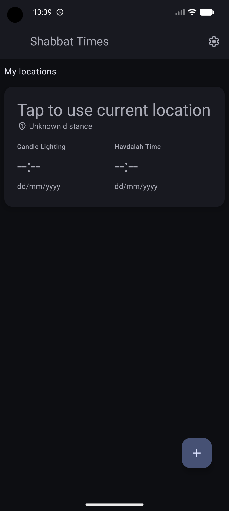
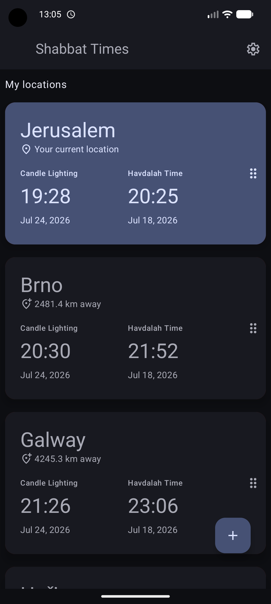
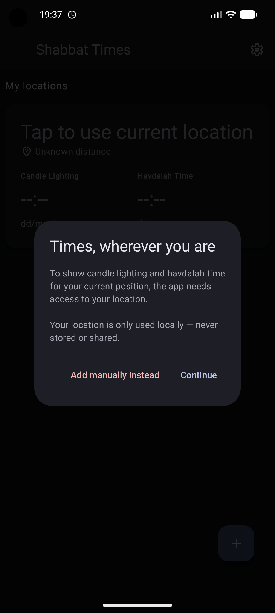
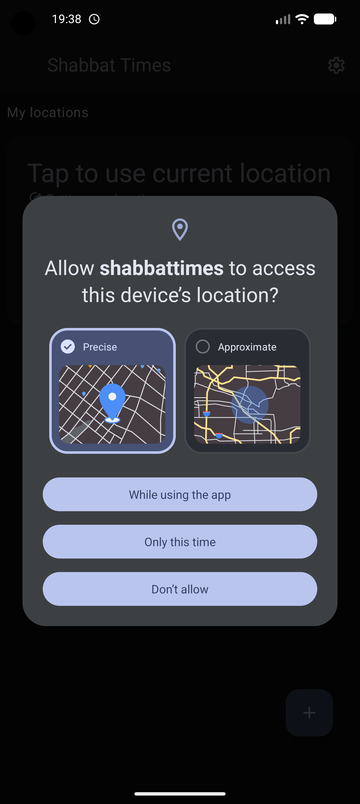
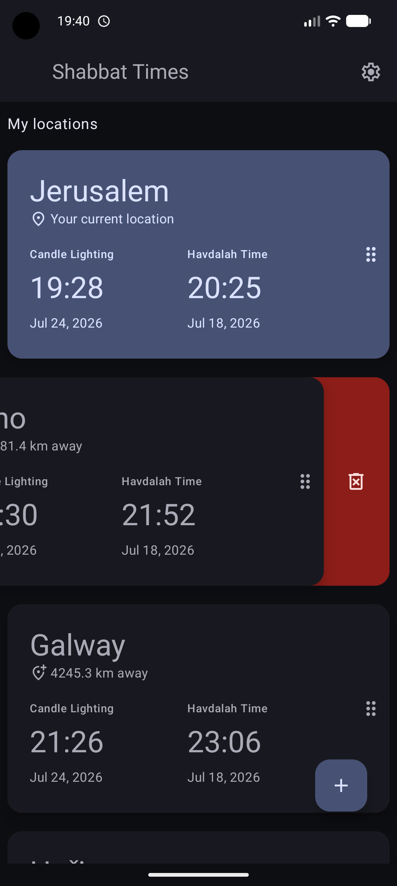
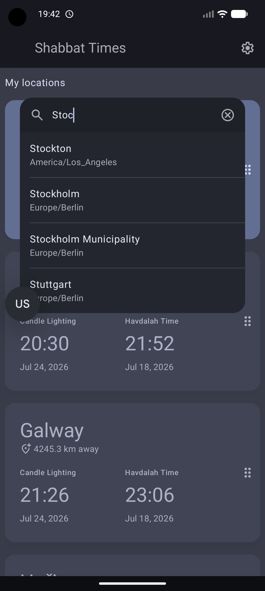
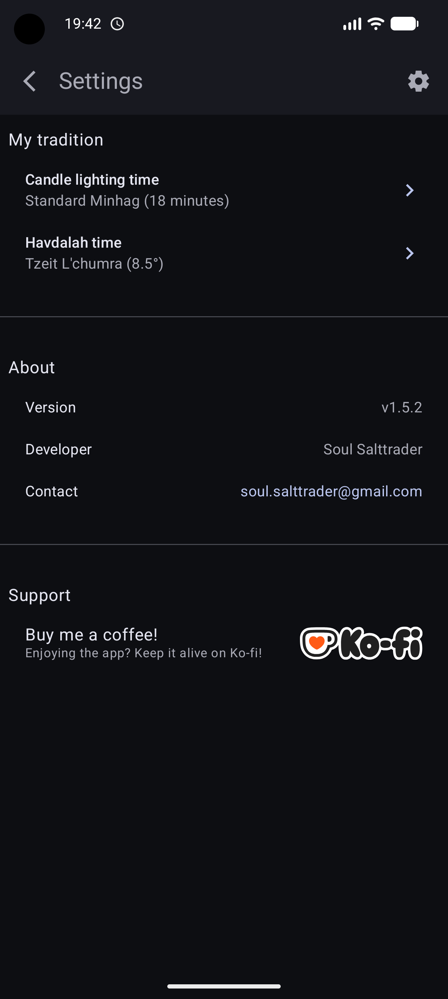
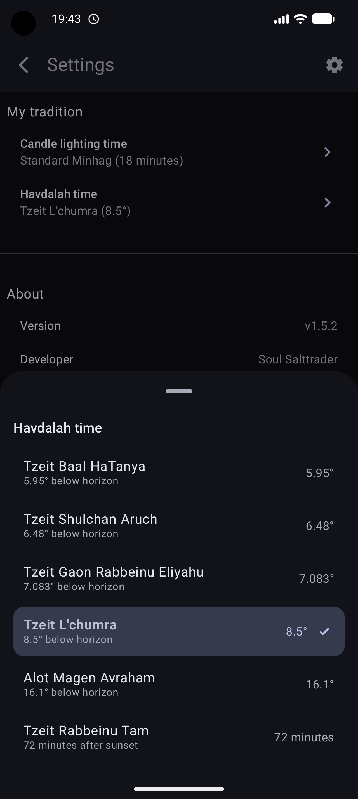

# Shabbat times app

Shabbat Times is a calendar app that displays accurate candle lighting and Havdalah times for multiple locations worldwide.

### Screenshots

- Screenshots reflect the current UI state at the time of capture.

  
  
  
  

  
  
  
  

### Features

- Shabbat times screen with:
  - Candle lighting date & time
  - Havdalah date & time
  - Fully functional REST API integration
  - Domain-accurate halachic time calculations
  - Strong type-safety with Kotlin time models
  - Location autocomplete search
  - Dynamic GPS location with permission handling
  - User-saved locations with drag-to-reorder (order persisted via Room)
  - Dynamic location labels (current location, distance in km, locating, no permission)
  - Swipe-to-delete saved locations
  - Auto-refresh current location on app restart if permission granted
- Settings screen with:
  - Community tradition selector (Sephardic, Mizrahi, Ashkenazi, Hasidic, Jerusalem)
  - About section (version, contact, developer)
  - Ko-fi support link

### Tech Stack

- Jetpack Compose
- Dagger Hilt
- MVI Architecture
- OkHttp + Retrofit
- KotlinX Serialization
- Room Persistence
- Kotlin Coroutines & Flow

### Build & Run

1. Clone the repository.
2. Open the project in Android Studio (latest stable version recommended) and let it sync Gradle — this will fetch the correct Android SDK components automatically.
3. Set up `local.properties`.
4. Add required API keys (Geo API key required in `local.properties` or as an environment variable).
5. Debug builds work out of the box with Android Studio's auto-generated debug key — no setup needed. 
6. Release builds require a signing keystore which is not included in this repository; contributors only need debug builds for local development.

Minimum supported Android version: **[Android 11 (API 30)]** (if testing on a physical device or emulator).

### Contributing

For detailed guidelines on how to contribute to this project, please see our [CONTRIBUTING](CONTRIBUTING.md).

### License

This project is proprietary software. All rights reserved. - see the [LICENSE](LICENSE.md) file for details.